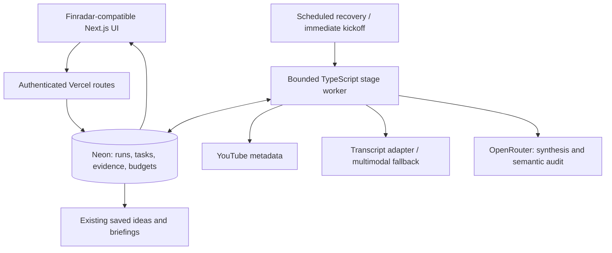

> Earlier research snapshot. For the deployed app and latest verification, see [completion report](completion-report.md).

# Video research: design and production plan

Prepared 13 September 2026. Proposal, not deployed implementation.

## Recommendation

Build the production module in TypeScript/Next.js on Vercel, with Neon/Postgres for durable state. Preserve the Python study as an evaluation harness. Port its small provider, validation and orchestration modules against shared JSON fixtures; it has no Python-only ML dependency that requires a separate production backend.

Finradar was inspected at commit `2747859c087dc1626e43b2b6fdb5871ede784247`. Its package manifest has Next.js 16.3.4, React 19.2.8, TypeScript, pg, Zod and Better Auth. Its source has task leasing/fencing, transactional budget reservations, timestamp-bearing evidence contracts, saved ideas and briefing features. Its Vercel configuration uses syd1 and scheduled workers. Repository evidence establishes implementation structure, not a fresh production verification. Older README passages describe superseded bootstrap states; use source over those passages.

Sources: [manifest](https://github.com/JoshuAI-888/finradar/blob/2747859c087dc1626e43b2b6fdb5871ede784247/package.json), [tasks](https://github.com/JoshuAI-888/finradar/blob/2747859c087dc1626e43b2b6fdb5871ede784247/src/server/platform/tasks.ts), [budget](https://github.com/JoshuAI-888/finradar/blob/2747859c087dc1626e43b2b6fdb5871ede784247/src/server/platform/budget.ts), [contracts](https://github.com/JoshuAI-888/finradar/blob/2747859c087dc1626e43b2b6fdb5871ede784247/src/contracts/index.ts).

## Vital design direction

Visited [vital.io](https://vital.io/) in Chrome and inspected its rendered homepage. Observed: white page and navigation, bold dark sans-serif headings with blue emphasis, vivid blue primary actions, pale-blue selected tabs, white cards with subtle borders/shadows, generous spacing and a rounded navy-to-blue feature panel. Translate these into the app without copying its healthcare imagery or branding.

Finradar already provides compatible tokens. Reuse these exact existing Finradar values; they are not claimed to be extracted Vital CSS:

| Role | Token/value |
|---|---|
| Surface | `--fr-bg: #ffffff` |
| Page | `--fr-page: #f7f9fc` |
| Text | `--fr-ink: #262626` |
| Secondary text | `--fr-muted: #626b7b` |
| Border | `--fr-line: #e5e9f0` |
| Primary | `--fr-primary: #194df4` |
| Selected background | `--fr-soft: #edf3ff` |
| Card radius | `--fr-radius: 14px` |
| Type | Existing Inter/system font stack |

Screen specification:
- Research home: compact heading, prominent URL field and blue Analyze action; tabs for Library, Channels and Saved ideas; restrained overview counts.
- Analysis: title/channel/date header, compact stage progress, video player beside English synthesis on desktop; evidence cards underneath or in an adjacent panel. Stack on mobile.
- Evidence: original-language quote, separately labelled English translation, timestamp action and source provenance. Use colour plus text for stance/status; never equate creator conviction with model confidence or investment probability.
- History: readable rows/cards, ticker/channel/language filters, explicit incomplete/unavailable/failed/no-ideas states. Metadata belongs in a collapsible diagnostics panel.
- Reuse Finradar navigation, table primitives, evidence viewer and idea-capture components at integration. Avoid a module-wide global CSS reset. A blue gradient can be a small onboarding accent; reading surfaces stay white.

Design acceptance: inspect desktop and mobile layouts against Vital and existing Finradar; check keyboard navigation, text contrast, wrapping of multilingual quotes, loading, errors, partial results and empty states. No app UI was implemented or visually verified in this planning step.

## Runtime and persistence

Submission persists a run and idempotent stage tasks, returning a run ID promptly. An immediate bounded kickoff reduces initial delay; the database-backed recovery worker is responsible for eventual progress even if the browser closes or kickoff fails. Poll status without triggering paid analysis.

Stages: metadata → transcript acquisition → coverage validation → candidate claims → synthesis → deterministic quote/number checks → semantic critique → immutable publication. Persist each stage output and input hash before progressing. Long sources are processed in bounded windows with overlap and segment IDs. Retry only recoverable failures with backoff; keep ambiguous provider outcomes reserved pending reconciliation. Reject stale worker writes using lease fencing. Cap concurrency and per-run/month spend transactionally. Extend Finradar's existing budgets for new providers; do not copy the prototype's sequential local ledger into production.

Reuse run_tasks and existing evidence/analysis concepts where their semantics fit. Add video/channel/transcript-segment/version records through additive migrations as needed. Extend source enums and timestamp end/coverage metadata explicitly. Represent indices separately from supported equity listings; do not force an index into an invented ETF ticker. Preserve original quote character offsets and text hashes. Cross-language validation must define offset semantics explicitly (JavaScript UTF-16 versus Python Unicode code points), with shared multilingual fixtures.

Cache by video + source hash + language + prompt version + model/configuration. Keep immutable published analyses and user-owned saved entries separate. Private uploads, if added, must not enter a public shared cache. Full transcript text can initially live in Postgres with retention metadata; add object storage only for real volume or authorized media uploads. SQLite remains local-only.

No vector database is required for one-video synthesis. Archive retrieval can begin with metadata and database text search; evaluate multilingual embeddings only when cross-video discovery becomes a measured requirement.

## Python and alternatives

Vercel **does support Python**, including FastAPI, Flask and Django, and supports Python streaming. With Fluid Compute, documented limits are 300 seconds on Hobby and generally available up to 800 seconds on Pro/Enterprise. Longer beta limits exist, but the design should checkpoint stages rather than depend on them. [Python runtime](https://vercel.com/docs/functions/runtimes/python), [limits](https://vercel.com/docs/functions/limitations).

| Option | Assessment |
|---|---|
| Next.js/TypeScript + Neon + bounded Vercel workers | Recommended: matches Finradar, reuses its platform and has fewest integration boundaries. |
| Next.js + separate Python Vercel functions | Viable interim path to keep Python runtime code. Still needs durable state, bounded stages, authenticated internal calls and two-language contracts. |
| Next.js + container worker elsewhere | Consider when measured ingestion needs native tools or workloads beyond function limits. Adds hosting, deployment and service authentication to operate. |

The existing Finradar cron worker pattern is a useful starting point, not proof that it handles every new failure mode. Cron delivery does not replace durable state or deduplication. [Vercel cron management](https://vercel.com/docs/cron-jobs/manage-cron-jobs). Confirm deployed plan and DB region before rollout; the checked-in syd1 setting does not establish Neon is colocated.

## Repository and migration path

In leapedge-study, retain `leapstudy/` and benchmark fixtures. Add a thin Next.js host with separable `src/features/video-research/` UI and domain modules, provider adapters, and JSON contracts. Keep route wiring minimal. Use a local repository adapter during development, then a Postgres adapter for hosted persistence. Do not build a second user-management product; a hosted personal pilot still needs an access gate on paid endpoints.

When integrating, move the feature into Finradar, wire routes into its existing shell, replace pilot platform adapters with existing auth/tasks/budget/evidence/idea services, and apply additive database migrations. Do not blindly migrate prototype cache files into published research. Import only explicitly validated source/report versions.

## Delivery gates

1. Freeze contracts and design tokens; add shared multilingual golden fixtures and reference screen layouts.
2. Working metadata/transcript path with duration coverage checks, unavailable-caption behaviour and resumable long-video processing. Treat machine transcription as unverified until independently checked; matching its text is not audio verification.
3. TypeScript analysis passes benchmark parity and semantic tests: conditional COIN advice, historical LMB price, missing late Meta section, index identity, educational no-trade control.
4. URL → progress → cited report → saved/reopened result, including original-language quotes and clickable timestamps. Explicitly label partial source coverage.
5. Private preview with transactional budgets and durable worker. Test duplicate submissions, browser closure, worker termination, expired lease, 429/timeout, exhausted funds and replay after deploy.
6. Integrate with Finradar behind a feature flag; confirm owner access, migration compatibility, backup/restore and rollback. Enable channel monitoring and combined briefings after single-video reliability passes.

## Budget policy

Proposed allocation of NZ$500/month, not vendor quotations: NZ$100 infrastructure allowance; NZ$300 model/transcript usage; NZ$100 contingency. Confirm incremental costs against existing Finradar subscriptions before buying anything. Track actual USD provider costs separately and use a dated conservative FX conversion for the NZD ceiling. Measure cost and p50/p95 latency by source length/language; previous small experiments do not establish production unit economics. A failed source acquisition can cost more than synthesis through repeated fallback, so cap those attempts as well.

## Current limits

This document proposes production architecture and design alignment. No Finradar code, infrastructure, migrations or production settings were changed. Its AGENTS.md assigns Codex planning/verification and other engines application implementation; that does not block this requested architecture work. The transcript supplier and production model default remain benchmark decisions, not established facts about LeapEdge internals.
