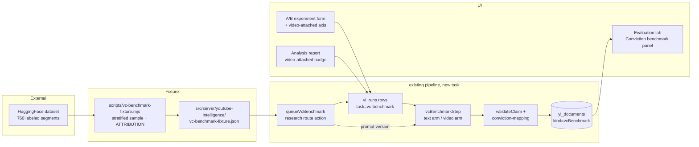

# Handoff — VideoConviction integration → Finradar YouTube Intelligence

Date: 2026-09-17 · Branch: `feat/youtube-intelligence` · Companion to: `handoff.md` (TrueAlphaData study; this document is intentionally a separate file so the two studies' plans never blur).

Source repo studied: [`gtfintechlab/VideoConviction`](https://github.com/gtfintechlab/VideoConviction) (KDD 2025, D&B Track, Georgia Tech FinTech Lab), cloned locally at `../VideoConviction`. Dataset: [`huggingface.co/datasets/gtfintechlab/VideoConviction`](https://huggingface.co/datasets/gtfintechlab/VideoConviction).

---

## 0. TL;DR

- VideoConviction is a **labeled benchmark + set of empirical findings** about exactly the task YTI performs: extracting stock recommendations, tickers and conviction from finfluencer YouTube video. It is **not** a production system, and we do not adopt its architecture.
- Finradar is a **personal, non-commercial project**, so the dataset's CC BY-NC 4.0 license (repo `LICENSE.md` says CC BY-NC-SA 4.0) is satisfied by **attribution**; the SA clause only binds if we redistribute a derived dataset.
- Three concrete integrations, in dependency order:
  - **A. Labeled benchmark harness** — run YTI's frozen extraction prompts over 760 expert-annotated video segments and score ticker / stance / conviction agreement. Lands as a new internal task (`input.task = "vc-benchmark"`) riding the existing pipeline, budget, retention and Evaluation-lab machinery.
  - **B. Conviction-calibration prompt version** (`evidence-first.web.v7`) — encodes VideoConviction's conviction rubric (title-vs-delivery consistency) into extraction + critique. Candidate-only until it wins on the benchmark and a fresh A/B.
  - **C. Video-attached extraction arm** — the paper's strongest positive result is that multimodal input improves ticker extraction. `modelCall` already supports `video=true`; we expose it as an A/B variant axis and a benchmark arm so the hypothesis is tested on our own data instead of being assumed.
- Optional/deferred: **D.** a discovery *ordering* signal ported from their title filter (ordering only, never exclusion), **E.** their `backtrader` backtest as an independent oracle for `performance.ts` once `scoreboard.ts` exists (handoff.md §8 Phase 1).
- Everything is descriptive research plumbing. No product claim changes: conviction stays a descriptive facet, never advice; experiment runs never enter the canonical collection; every paid call stays inside the reserved budget.

---

## 1. Source inventory (what was inspected)

| Artifact | Location | Notes |
|---|---|---|
| Main README | `VideoConviction/README.md` | Paper abstract, findings, repo map, license section |
| Data pipeline | `youtube_data_pipeline/run_pipeline.py`, `filter_and_sample/video_filter.py`, `utils.py` | YouTube Data API collection → title-keyword filter → sampling → download → transcribe |
| Extraction prompts | `prompting/inference/good_full_length_OpenAPIPrompting.ipynb`, `GeminiPrompt.ipynb` | The Action/Conviction/Ticker schema; text-only vs video arms; 0.25 fps / 512 px frame sampling for GPT-4o; Gemini file-upload path |
| Segmented path | `prompting/inference/segments_lm_annotation.ipynb` | Full-video vs segment inputs |
| Evaluation | `prompting/evaluation/parse_and_evaluate.ipynb` | Parse model JSON vs expert labels |
| Backtesting | `back_testing/main.ipynb` | `backtrader` strategies + Polygon.io daily bars 2018–2024; SPY/QQQ benchmarks; penny exclusion; ticker corrections map |
| Dataset | HF `gtfintechlab/VideoConviction` | **train split, 760 rows**, segment-level; fields include `video_id, start, end, action, action_source, conviction_score, ticker_name, is_rec_present, transcript, segment_transcript, youtube_video_url, duration, isCaptionAvailable`, plus video/channel/engagement metadata |
| License | `LICENSE.md` + HF card | CC BY-NC-SA 4.0 (repo) / CC BY-NC 4.0 (HF card) — non-commercial; attribution required |

Their extraction output schema (verbatim fields): `Stock Recommendations Present: Yes|No`, then per recommendation `{Action: "Buy | Hold | Don't Buy | Sell | Short Sell | Unclear", Justification, Conviction Score: 1|2|3, Ticker Name}`.

Headline findings we are acting on:

1. **Multimodal input improves ticker extraction** vs text-only.
2. **LLMs and MLLMs conflate general commentary with definitive recommendations and misjudge conviction** — the two failure modes YTI's `validateClaim` + critique stage were designed against.
3. **High-conviction recommendations still underperform SPY; the inverse strategy beats SPY by ~6.8%/yr (Sharpe 0.41 vs 0.65)** — conviction is not an alpha signal by itself.

---

## 2. Why this integration is needed, and why this shape is correct

**Needed.** YTI currently has *no external ground truth* for the three fields that matter most — `ticker`, `stance`, `creator_conviction`. Regression checks (`evaluations/checks.ts`) are hard-coded to five hand-picked video IDs; A/B comparisons (`comparison` + `review`) are self-referential (our model vs our model, graded by us). VideoConviction supplies 760 segments labeled by domain experts (457 hours of human effort) for precisely those fields. That converts "we think prompt v7 is better" into "prompt v7 moves expert-label agreement by X points, and here is the confusion matrix."

**Correct shape — three reasons:**

1. **We adopt their labels and findings, not their architecture.** Their pipeline is research-grade: keyword title filters decide inclusion, transcripts are unanchored CSV text, no evidence requirement exists, and their own backtest found the resulting recommendations underperform SPY. YTI's evidence-first design (segment-anchored quotes, `validateClaim`, independent critique, immutable forward observations) is strictly stronger on every axis they got wrong. The correct move is to grade our extractor against their *labels* — the part that took 457 human hours and that we cannot cheaply reproduce — and ignore the rest.
2. **The benchmark must ride the existing pipeline, not sit beside it.** The repo already has a task pattern for side-experiments (`input.task` values `entity-classification`, `audio-review`, `briefing`): task runs use the same `reserve/settle/retainResponse` budget ledger, the same lease-based worker, the same retained-response store, and are **automatically excluded** from the canonical collection by `canonicalRuns()` filtering `r.input.task`. A benchmark that bypassed this would create a second, unaudited spend path — the exact failure mode the invariants forbid.
3. **Prompt changes must be measurement-gated, not vibes-gated.** `prompt-versions.json` shows the established discipline: each version carries a `rationale`, candidates stay candidates, and promotion follows held-out comparison. Conviction is the field where the paper proves models are weakest (finding 2), and it is also the field YTI's scoring gate leans on (`scoreCall` eligibility = stance long/short **+ conviction medium/high**, handoff.md §3 step 2). A rubric improvement to conviction labeling therefore has compounding value — but only if the benchmark can detect it. That is why Workstream A precedes Workstream B.

**What we deliberately do NOT adopt** (and why):

| Their mechanism | Why we reject it |
|---|---|
| Title-keyword **exclusion** filter (`video_filter.py`) | It is a recall killer by design: "market analysis" titles can contain real calls. We analyze everything and let extraction + audit decide. (We reuse it only as an *ordering* signal — §8.) |
| `Action` enum as the product taxonomy | Ours is finer and evidence-bound (`stance` 7-way + `conditions_en` + `levels` with verbatim-price checks). We map *their labels → our enum* for scoring, never the reverse. |
| Frame-sampling inference path (0.25 fps, 512 px, GPT-4o / LLaVA) | Superseded: Gemini consumes the YouTube URL directly (`native-google-core.ts`, and OpenRouter `video_url` restricted to Google AI Studio). No download/storage pipeline to maintain. |
| `backtrader` + Polygon backtest as our engine | Duplicate of `market.ts` + planned `scoreboard.ts` with worse hygiene (their entry at same-day close embeds look-ahead; ours enters the next common session by design). Kept only as a cross-vendor oracle (§9). |
| Conviction-weighted strategy construction | Finding 3 says high conviction ≠ alpha. We keep conviction descriptive; the scoreboard must *report* conviction-stratified alpha, not weight by it. |

---

## 3. Provenance & licensing

- License: **CC BY-NC 4.0** (HF card) / **CC BY-NC-SA 4.0** (repo `LICENSE.md`). Finradar/YTI is a personal, non-commercial project → use is permitted **with attribution**. The SA clause binds only if we distribute a derived dataset; the proposed committed fixture (§5.3) is a derived sample, so it ships with an `ATTRIBUTION.md` and this document as the required attribution + change indication, and the repo is already public on the same terms.
- Attribution block to place in `docs/videocviction-dataset.md` and in the fixture header:

  > Contains a derived sample of the VideoConviction dataset (Galarnyk, Kejriwal, Shah, Bhardwaj, Watney Meyer, Krishnan, Chava — Georgia Institute of Technology, KDD 2025), licensed CC BY-NC-SA 4.0. Used for non-commercial benchmarking of the YouTube Intelligence research lab. Labels are expert annotations; provenance and license: https://huggingface.co/datasets/gtfintechlab/VideoConviction
- **Never** ship the dataset, the fixture, or benchmark outputs to the hosted Vercel deployment's public share snapshots; benchmark documents are workspace-internal (`yi_documents`), consistent with how `audioReview` and `transcriptAccuracy` records are already handled.
- If Finradar ever becomes commercial: stop at §0 step A.3 — delete the fixture, keep only the *findings* (facts are not copyrightable) and re-run the fetch script under a obtained license or with self-labeled data.

---

## 4. Integration overview



Workstreams and their outcomes:

| # | Workstream | Outcome it buys us |
|---|---|---|
| A | Labeled benchmark harness | Expert-grounded agreement numbers for ticker/stance/conviction; confusion matrices; no-rec precision |
| B | Prompt `evidence-first.web.v7` (conviction rubric) | A *testable* candidate that targets the field the paper proves weakest, and that our scoring gate depends on |
| C | Video-attached extraction arm | Turns the paper's "multimodal helps ticker extraction" into a measured A/B on our own sources |
| D | Discovery ordering signal (optional) | Cheaper channel pulls: recommendation-flavored uploads analyzed first, without excluding anything |
| E | Backtest oracle (deferred) | Cross-vendor validation of `performance.ts` when the scoreboard phase lands |

---

## 5. Workstream A — Labeled benchmark harness

### 5.1 Why

See §2. Practical target: **60-row stratified pilot** (default), full 760 available. One `yi_runs` row per labeled segment; results accumulate as `yi_documents(kind="vcBenchmark")`; the panel aggregates per `(model, promptVersion, arm)`.

### 5.2 Label mapping — new `src/features/youtube-intelligence/conviction-mapping.ts`

Pure, dependency-free, unit-testable — same style as `performance.ts`/`trends.ts`. **Why this mapping and not another:** each rule is the least-surprising translation of their label into our closed enums; where translation is lossy (Unclear) we choose the *weakest* stance (`watch`) so the benchmark can only under-count our precision, never inflate it.

```ts
import { z } from "zod";

// VideoConviction labels (paper §schema; dataset fields `action`, `conviction_score`).
export const VcAction = z.enum([
  "Buy",
  "Hold",
  "Don't Buy",
  "Sell",
  "Short Sell",
  "Unclear",
]);

export type YtiStance =
  | "long"
  | "short"
  | "neutral"
  | "avoid"
  | "watch"
  | "hold"
  | "conditional";

// Buy→long; Sell/Short Sell→short; Hold→hold; Don't Buy→avoid; Unclear→watch (weakest).
export function actionToStance(action: string): YtiStance | null {
  switch (action) {
    case "Buy":
      return "long";
    case "Sell":
    case "Short Sell":
      return "short";
    case "Hold":
      return "hold";
    case "Don't Buy":
      return "avoid";
    case "Unclear":
      return "watch";
    default:
      return null;
  }
}

// Their 1|2|3 → our low|medium|high. Their scale has no "unspecified".
export function convictionToLabel(score: number | null): "low" | "medium" | "high" {
  return score === 3 ? "high" : score === 2 ? "medium" : "low";
}

// Format-only normalization ("NASDAQ:AAPL", "aapl ", "AI†" tail cases).
// Deliberately NOT semantic correction: their backtest maps APPL→AAPL etc.;
// a benchmark that silently repairs labels would overstate ticker accuracy.
// "APPL" counts as a miss, and the miss is visible in the record.
export function normalizeVcTicker(raw: string | null | undefined): string | null {
  if (!raw) return null;
  const t = raw.trim().toUpperCase().split(":").pop()!.split(" ").pop()!;
  return /^[A-Z0-9.^=-]{1,20}$/.test(t) ? t : null;
}

export type VcExpectation = {
  rowId: string;
  isRecPresent: string; // "Yes" | "No"
  action: string;
  convictionScore: number | null;
  ticker: string | null;
};

export type VcPrediction = {
  ticker: string | null;
  tickerExplicit: boolean;
  stance: YtiStance;
  conviction: string;
};

export type VcRowScore =
  | { kind: "no_rec"; noRecRespected: boolean }
  | {
      kind: "rec";
      matched: boolean; // a prediction existed to compare
      tickerMatch: boolean;
      stanceMatch: boolean;
      convictionMatch: boolean;
      expected: { ticker: string | null; stance: YtiStance; conviction: string };
      predicted: VcPrediction | null;
    };

export function scoreVcRow(e: VcExpectation, predicted: VcPrediction[]): VcRowScore {
  const expectedStance = e.isRecPresent === "Yes" ? actionToStance(e.action) : null;
  if (!expectedStance)
    return { kind: "no_rec", noRecRespected: predicted.length === 0 };
  const want = normalizeVcTicker(e.ticker);
  // Prefer the prediction naming the expected ticker; else compare against the first claim.
  const best =
    predicted.find((p) => p.ticker && want && p.ticker === want) || predicted[0];
  if (!best)
    return {
      kind: "rec",
      matched: false,
      tickerMatch: false,
      stanceMatch: false,
      convictionMatch: false,
      expected: { ticker: want, stance: expectedStance, conviction: convictionToLabel(e.convictionScore) },
      predicted: null,
    };
  return {
    kind: "rec",
    matched: true,
    tickerMatch: !!want && best.tickerExplicit && best.ticker === want,
    stanceMatch: best.stance === expectedStance,
    convictionMatch: best.conviction === convictionToLabel(e.convictionScore),
    expected: { ticker: want, stance: expectedStance, conviction: convictionToLabel(e.convictionScore) },
    predicted: best,
  };
}
```

### 5.3 Fixture — committed sample + fetch script

**New `scripts/vc-benchmark-fixture.mjs`** (development-only; uses the HF datasets-server JSON API so no parquet tooling is needed):

```js
// Fetches the VideoConviction train split and writes a stratified sample fixture.
// Development tool only; the repo commits the derived sample + ATTRIBUTION, not the full dataset.
const URL = "https://datasets-server.huggingface.co/rows?dataset=gtfintechlab%2FVideoConviction&config=default&split=train";
const rows = [];
for (let offset = 0; ; offset += 100) {
  const r = await fetch(`${URL}&offset=${offset}&length=100`).then((x) => x.json());
  rows.push(...r.rows.map((x) => x.row));
  if (r.num_rows_total == null || rows.length >= r.num_rows_total) break;
}
console.log("fetched", rows.length, "rows");
console.log("is_rec_present mix:", [...new Set(rows.map((r) => r.is_rec_present))]);
// Stratify: every distinct action bucket, plus up to 10 no-rec rows, up to N total.
const N = Number(process.argv[2] || 60);
const buckets = new Map();
for (const r of rows) {
  const k = r.is_rec_present === "Yes" ? `rec:${r.action}` : "no_rec";
  (buckets.get(k) || buckets.set(k, []).get(k)).push(r);
}
const per = Math.max(1, Math.floor(N / buckets.size));
const sample = [];
for (const [k, rs] of [...buckets.entries()].sort()) sample.push(...rs.slice(0, k === "no_rec" ? Math.min(10, per) : per));
const fixture = sample.slice(0, N).map((r) => ({
  id: String(r.id ?? `${r.video_id}:${r.start}`),
  videoId: r.video_id,
  start: r.start,
  end: r.end,
  durationSeconds: r.duration ?? null,
  captionAvailable: r.isCaptionAvailable === true || r.isCaptionAvailable === "True",
  actionSource: r.action_source ?? null,
  expected: {
    isRecPresent: r.is_rec_present,
    action: r.action ?? null,
    convictionScore: r.conviction_score ?? null,
    ticker: r.ticker_name ?? null,
  },
  segment: String(r.segment_transcript || r.transcript || ""),
}));
await import("node:fs").then((fs) =>
  fs.writeFileSync("src/server/youtube-intelligence/vc-benchmark-fixture.json", JSON.stringify(fixture, null, 2)),
);
console.log("wrote", fixture.length, "rows");
```

**New `src/server/youtube-intelligence/vc-benchmark-fixture.json`** — the committed derived sample (~60 compact rows: id, videoId, start/end, expected labels, segment text). Ships with `docs/videocviction-dataset.md` (attribution §3). **Why commit a sample:** reproducibility — every prompt version in `yi_prompts` is permanent, so its benchmark score must be reproducible too; a URL that HF may re-publish would break that. **Why not commit all 760:** minimum necessary footprint; the fetch script reconstitutes the full set on demand.

> NOTE: strip the header row `//` comment above before committing the generated JSON (pure array file, same as `prompt-versions.json`).

### 5.4 Pipeline task — new `src/server/youtube-intelligence/vc-benchmark.ts`

**Why a task run per segment** (not a batch loop): each segment gets its own retained response (`yi_responses`), its own cost ledger row (`yi_calls`), checkpoint/resume for free, and per-row failure isolation — identical guarantees to every other paid call in the system. **Why `stage` never advances through the main pipeline:** the main stages assume a video metadata fetch and caption acquisition; the benchmark's source is the *expert-retained segment transcript*, so the task branch short-circuits `step()` before stage dispatch.

```ts
import { z } from "zod";
import {
  Claim,
  Source,
  anchorClaimEvidence,
  validateClaim,
  type Run,
  type CheckedClaim,
} from "../../features/youtube-intelligence/contracts.ts";
import { modelCall } from "./pipeline.ts";
import { create, get } from "./store.ts";
import { put, prompt } from "./research-store.ts";
import {
  scoreVcRow,
  type VcPrediction,
} from "../../features/youtube-intelligence/conviction-mapping.ts";
import fixture from "./vc-benchmark-fixture.json" with { type: "json" };

const Row = z.object({
  id: z.string(),
  videoId: z.string(),
  start: z.number().nullable(),
  end: z.number().nullable(),
  durationSeconds: z.number().nullable(),
  captionAvailable: z.boolean(),
  actionSource: z.string().nullable(),
  expected: z.object({
    isRecPresent: z.string(),
    action: z.string().nullable(),
    convictionScore: z.number().int().min(1).max(3).nullable(),
    ticker: z.string().nullable(),
  }),
  segment: z.string().min(1),
});
const Rows = z.array(Row);
const rows = Rows.parse(fixture);
// The paper's prompting set is the "Selected region" rows; we keep that filter for
// rec rows so our numbers are comparable to theirs, and allow no-rec rows regardless.
const eligible = rows.filter(
  (r) => r.expected.isRecPresent !== "Yes" || r.actionSource === "Selected region",
);

export const VIDEO_ARM_MAX_SECONDS = 900;

// Deterministic round-robin over action buckets; stable across calls so a prompt
// version's score is always computed on the same rows.
export function stratify(n: number) {
  const buckets = new Map<string, Row[]>();
  for (const r of eligible) {
    const k = r.expected.isRecPresent === "Yes" ? `rec:${r.expected.action}` : "no_rec";
    (buckets.get(k) || buckets.set(k, []).get(k)).push(r);
  }
  const picked: Row[] = [];
  for (let i = 0; picked.length < n; i++)
    for (const rs of [...buckets.values()].sort((a, b) => (a[0].id < b[0].id ? -1 : 1)))
      if (rs[i] && picked.length < n) picked.push(rs[i]);
  return picked;
}

export async function queueVcBenchmark(input: unknown) {
  const a = z
    .object({
      sampleSize: z.number().int().min(5).max(eligible.length).default(60),
      model: z.string(),
      promptVersion: z.string(),
      arm: z.enum(["text", "video"]).default("text"),
    })
    .parse(input);
  const snapshot = await prompt(a.promptVersion); // frozen per run, like every other run
  const selected = stratify(a.sampleSize);
  const created = [];
  for (const row of selected) {
    if (a.arm === "video") {
      if (!row.captionAvailable && !row.segment)
        throw Error(`Row ${row.id} has neither captions nor segment text; cannot benchmark.`);
      if ((row.durationSeconds ?? 0) > VIDEO_ARM_MAX_SECONDS)
        throw Error(
          `Row ${row.id} exceeds the ${VIDEO_ARM_MAX_SECONDS}s video-arm bound. Shorten the sample.`,
        );
    }
    const source = Source.parse({
      video_id: row.videoId,
      source_kind: "imported_transcript",
      segments: [{ id: "s00001", text: row.segment, start_seconds: row.start, end_seconds: row.end }],
    });
    const run = await create(
      row.videoId,
      a.model,
      {
        task: "vc-benchmark",
        vcArm: a.arm,
        vcRowId: row.id,
        source, // frozen expert segment; no caption acquisition, no video download
        promptSnapshot: snapshot,
        pipelineVersion: "research.v5.vc-benchmark",
        inferenceConfig: { critiqueMaxTokens: 3000 },
      },
      a.promptVersion,
    );
    created.push(run.id);
  }
  await put("vcBenchmarkBatch", `batch:${new Date().toISOString()}`, {
    count: created.length,
    arm: a.arm,
    model: a.model,
    promptVersion: a.promptVersion,
    runIds: created,
  });
  return { queued: created.length, arm: a.arm };
}

export async function vcBenchmarkStep(run: Run, call = modelCall) {
  const row = rows.find((r) => r.id === run.input.vcRowId);
  if (!row) throw Error("Benchmark row is missing from the fixture; rerun the fetch script.");
  const source = Source.parse(run.input.source);
  const video = run.input.vcArm === "video";
  // Payload mirrors the main synthesis call: retained transcript + evidence format
  // contract. The benchmark asks for claims only; key_points are out of scope here.
  const raw = await call(
    run,
    video ? "vc-video-extract" : "vc-extract",
    run.model,
    run.input.promptSnapshot.synthesis + "\n" + run.input.promptSnapshot.extraction,
    {
      source,
      benchmark: "Scored against expert labels. Return only instrument-specific claims in claims; an empty claims array is valid when the speaker makes no recommendation.",
      evidenceFormat:
        "Use segment_id for the first real cue ID and end_segment_id for the last real cue ID. Copy an exact contiguous quote; no ellipses or paraphrases.",
    },
    video,
  );
  const draft = z.object({ claims: z.array(Claim).max(10) }).parse(raw);
  const checked: CheckedClaim[] = draft.claims
    .map((c) => anchorClaimEvidence(c, source))
    .map((claim, i) => ({
      id: `c${i + 1}`,
      claim,
      passed: false,
      reasons: validateClaim(claim, source),
    }));
  const predictions: VcPrediction[] = checked.map((c) => ({
    ticker: c.claim.ticker,
    tickerExplicit: c.claim.ticker_explicit,
    stance: c.claim.stance,
    conviction: c.claim.creator_conviction,
  }));
  const result = scoreVcRow(
    {
      rowId: row.id,
      isRecPresent: row.expected.isRecPresent,
      action: row.expected.action ?? "",
      convictionScore: row.expected.convictionScore,
      ticker: row.expected.ticker,
    },
    predictions,
  );
  run.output.vcResult = {
    rowId: row.id,
    expected: result.kind === "rec" ? result.expected : null,
    result,
    evidenceValid: checked.filter((c) => c.reasons.length === 0).length,
    evidenceTotal: checked.length,
  };
  run.output.limitations = [
    "Benchmark segment text is an expert-retained excerpt, not a full-video analysis; coverage metrics do not apply.",
  ];
  run.status = "completed";
  run.stage = "complete";
  const id = `vcBenchmark:${run.id}`;
  await put("vcBenchmark", id, {
    id,
    at: new Date().toISOString(),
    runId: run.id,
    videoId: run.videoId,
    rowId: row.id,
    arm: run.input.vcArm,
    model: run.model,
    promptVersion: run.promptVersion,
    result: run.output.vcResult,
    cost: run.cost,
  });
  return run;
}
```

**Wire into `pipeline.ts` `step()`** (one branch, before the native-source branch):

```ts
  if (run.input.task === "vc-benchmark") {
    const { vcBenchmarkStep } = await import("./vc-benchmark.ts");
    return vcBenchmarkStep(run);
  }
```

**Why scoring ignores `passed`/critique:** the benchmark measures the *extractor*, not the auditor — expert labels compare against raw claims; `validateClaim` results are recorded (`evidenceValid/Total`) because evidence-grounding is our own quality bar and worth tracking per prompt version, but a failed grounding does not erase the ticker/stance comparison (it is reported separately). This is a deliberate divergence from `gradeRun`, which gates publication.

### 5.5 API action — `src/app/api/intelligence/research/route.ts`

One switch case, consistent with `experiment`/`captionProbe`:

```ts
      case "vcBenchmark": {
        const { queueVcBenchmark } =
          await import("../../../../server/youtube-intelligence/vc-benchmark.ts");
        result = await queueVcBenchmark(a.data);
        break;
      }
```

And in `research-store.ts` `researchSnapshot()`:

```ts
    vcBenchmarks: await readDocs("vcBenchmark"),
    vcBenchmarkBatches: await readDocs("vcBenchmarkBatch"),
```

**Exclusion from canonical data is automatic and must stay that way:** `canonicalRuns()` filters `r.input.task`; `evaluationRuns` (the A/B baseline list) filters `!r.input.task`. No new filtering code — the invariant is inherited. A unit test pins this (§12).

### 5.6 Cost & budget

- **Text arm:** segment payloads are small; with the flash models in `MODELS`, a 60-row pilot is comfortably inside the default `YTI_BUDGET_USD=2` ceiling (reservation per row ≈ (payload+4096)·inputRate + 16000·outputRate; observed flash pricing puts the pilot in the cents range). Reservations are worst-case by design; actual settlement uses provider-reported usage as everywhere else.
- **Video arm:** `modelCall` already switches the input bound to `spec.context_length` when `video=true` (conservative, provider-agnostic). For long-context Gemini that can reserve ≈$0.5–1 per call — which is why `queueVcBenchmark` bounds the video arm to `durationSeconds ≤ 900` and the UI defaults the video pilot to **10 rows**. Raise `YTI_BUDGET_USD` deliberately for a video pilot; never silently.
- Failed/uncertain outcomes remain reserved (existing behavior — "uncertain calls are not automatically retried"), so a flaky provider can hold budget; the tokens/cost panel (`Tokens, cost and processing history`) already exposes `yi_calls` for diagnosis.

---

## 6. Workstream B — conviction-calibration prompt `evidence-first.web.v7`

### 6.1 Why this prompt change, why now

- The paper's central failure finding: models **inflate commentary into recommendations and misjudge conviction**. YTI already fights the first half (v5/v6 CLASSIFICATION blocks; `checks.ts` "must not invent a creator investment decision"). The second half is under-specified: v2 added one sentence ("Do not assign high/medium creator conviction merely because a speaker is fluent or emphatic"), but there is **no positive definition** of what each conviction level *means*. Lacking a definition, models default to delivery confidence — exactly the paper's error mode.
- It matters beyond labeling: `scoreCall` eligibility gates on conviction medium/high (handoff.md §3 step 2). Systematic conviction inflation changes *which calls get scored*, i.e. it can silently bias the future leaderboard. So the rubric is not cosmetic.
- The rubric's substance is VideoConviction's annotation guidance: conviction is assessed from **title-claim vs supporting-content consistency**, specificity of reasoning, and hedging — never from production quality or speaker confidence. (Their prompt encodes: bold title + no support = low; bold title + consistent confidence = moderate; strong alignment = high.)

### 6.2 Proposed `prompt-versions.json` entry (candidate, prepended)

`id`: `evidence-first.web.v7` · `rationale`: `"Candidate only: add an explicit conviction rubric (commitment present in quotes vs delivery confidence), derived from VideoConviction KDD-2025 annotation guidance. Promote only if vc-benchmark conviction agreement and a fresh same-source A/B both improve without regressions."`

`transcribe`, `synthesis`, `critique`: identical to v6 (change one variable at a time), **except** the additions below.

`extraction` — append one block to the v6 extraction text:

```
CONVICTION CALIBRATION: creator_conviction measures the strength of commitment
expressed for THIS claim in the retained source, never speaker fluency, tone or
production quality. Calibrate from the quotes:
- high: an explicit, unhedged decision with instrument-specific reasoning
  (position, thesis and stated condition are all present).
- medium: a clear directional view with hedging, conditions, or reasoning that
  stays general rather than instrument-specific.
- low: tentative or exploratory treatment; or a bold title claim without
  matching support in the source.
- unspecified: no commitment expressed about the instrument.
Title claims unsupported by the retained source stay low or unspecified.
```

`critique` — append:

```
CONVICTION AUDIT: check creator_conviction against the quoted evidence alone.
Reject claims whose conviction exceeds what the quotes support; an emphatic
delivery is not evidence of conviction, and a repeated opinion is not a decision.
```

### 6.3 Promotion gate (how B "ships")

1. Run benchmark arm `text` at 60 rows, `(model = google/gemini-3.8-flash, promptVersion = evidence-first.web.v5)` → baseline record.
2. Same at `evidence-first.web.v7` → candidate record. Same rows (deterministic `stratify`), same frozen sources.
3. Accept for promotion only if: conviction agreement improves ≥ +5 percentage points, stance agreement and no-rec precision do not regress > 2 points, and per-row evidence-valid rate does not drop.
4. Independently queue one fresh same-source A/B (`startExperiment`, v5 vs v7) on a retained full video — the benchmark segments are excerpts; the A/B proves full-video behavior didn't regress.
5. Record the outcome in the Improvement journal (`improvement` doc, `status: accepted` requires the comparison id — existing enforcement).
6. Only then flip `preferences.promptVersion` default. Until then v7 is a variant, exactly like v6 today.

---

## 7. Workstream C — video-attached extraction arm

### 7.1 Why

Paper finding 1 (multimodal improves ticker extraction) is the one result that suggests a *capability* change rather than a prompt tweak — and YTI is uniquely positioned to test it cheaply because Gemini accepts the YouTube URL directly (`modelCall` already appends `video_url` and restricts providers to Google AI Studio when `video=true`). Today `video=true` is used only for transcription stages. We expose it for extraction as an **experiment axis**, not a mode switch: the payload keeps the retained transcript (their best condition is video + transcript + title), so the video adds signal that text alone must still ground against — evidence rules (`validateClaim`) are unchanged, which keeps the comparison apples-to-apples.

### 7.2 Code changes (three small diffs)

**`experiments.ts`** — add the axis to the spec and plumb it:

```ts
const Spec = z.object({
  baselineId: z.string(),
  hypothesis: z.string().min(10).max(3000),
  variants: z
    .array(
      z.object({
        model: z.enum(MODELS),
        criticModel: z.enum(MODELS),
        promptVersion: z.string(),
        videoAttached: z.boolean().optional(), // NEW: extraction sees the full video
      }),
    )
    .min(2)
    .max(4),
});
```

In `startExperiment`, before queueing (guard + pass-through; distinctness already uses `JSON.stringify`, so the axis participates):

```ts
  const duration = (baseline.output.metadata as { duration: number }).duration;
  if (spec.variants.some((v) => v.videoAttached) && duration > 7200)
    throw Error("Video-attached extraction is bounded to sources of at most 2 hours.");
  // ...
      runs.push(
        await queue(baseline.videoId, source, {
          ...v,
          videoAttachedExtraction: v.videoAttached === true,
        }, true),
      );
```

**`research-store.ts` `queue()`** — widen the config type and persist the flag:

```ts
export async function queue(
  videoId: string,
  source?: unknown,
  config?: Partial<PreferencesData> & { videoAttachedExtraction?: boolean },
  experiment = false,
) {
  // ...
    {
      // ...existing fields...
      videoAttachedExtraction: config?.videoAttachedExtraction === true,
    },
```

**`pipeline.ts` synthesis stage** — pass the flag into `modelCall`'s existing `video` parameter and label the run:

```ts
  } else if (run.stage === "synthesis") {
    const source = run.output.source as SourceData;
    const videoAttached = run.input.videoAttachedExtraction === true;
    if (videoAttached) run.output.extractionMode = "video_attached";
    const chunks = sourceChunks(source);
    // ...
        await modelCall(
          run,
          chunks.length === 1 ? "synthesis" : `synthesis-chunk-${chunkIndex}`,
          run.model,
          prompts.synthesis +
            "\n" +
            prompts.extraction +
            (chunks.length > 1
              ? "\nThis is one chronological excerpt. Extract only claims supported here; retain conditions and do not infer the rest of the video."
              : "") +
            (videoAttached
              ? "\nThe full video is attached as additional context. Every claim, ticker, level and conviction must still be grounded in the retained source segments; the video may disambigate speech, on-screen tickers and who is speaking, and must never introduce an unsupported detail."
              : ""),
          {
            source: chunks[chunkIndex],
            // ...existing payload fields...
          },
          videoAttached, // NEW: reuses the existing video_url + Google AI Studio path
        ),
```

### 7.3 Guards and why each exists

| Guard | Rationale |
|---|---|
| Duration ≤ 7200 s (experiments) / ≤ 900 s (benchmark video arm) | `modelCall` reserves `context_length × inputRate` when video is attached — the budget knob is the duration cap, not the ledger. |
| Provider restricted to Google AI Studio | Already enforced in `modelCall` (`only: ["Google AI Studio"]`); OpenRouter fallbacks would break the video content part. |
| Runs keep `input.experiment = true` | `canonicalRuns()` excludes them unless explicitly published — a video-attached run can never silently replace a collection report (invariant 4). |
| Evidence contract unchanged | If the video arm only wins by loosening grounding, that's a loss, not a win: `validateClaim` still rejects non-verbatim tickers/prices, and the benchmark's evidence-valid rate tracks it. |

---

## 8. Workstream D (optional) — discovery ordering signal

Port of their `video_filter.py` keywords, demoted from *exclusion* to *ordering*:

**New `src/features/youtube-intelligence/recommendation-signal.ts`:**

```ts
const RECOMMENDATION = ["buy","buying","bought","sell","selling","sold","hold","holding","held","bullish","bearish"];
const ANALYSIS = ["analysis","market analysis","review","market review","crypto","cryptocurrency","bitcoin","btc","ethereum","eth","altcoin","altcoins","estate"];
const DESCRIPTORS = ["best","top","worth","worst","tanking"];
const TYPES = ["stock","stocks","etf","etfs","company","companies"];

export type Signal = { kind: "recommendation" | "neutral" | "analysis"; matched: string[] };

// Ordering heuristic only (VideoConviction video_filter.py, ported). NEVER a filter:
// "market analysis" titles contain real calls; YTI analyzes everything and lets the
// extractor and audit decide. This only decides what gets analyzed first.
export function recommendationSignal(title: string): Signal {
  const words = new Set(title.toUpperCase().split(/\s+/));
  const hit = (list: string[]) => list.filter((p) => words.has(p.toUpperCase()));
  const rec = hit(RECOMMENDATION);
  const pair = (a: string[], b: string[]) =>
    a.some((x) => title.toUpperCase().includes(x.toUpperCase())) &&
    b.some((y) => title.toUpperCase().includes(y.toUpperCase()));
  if (rec.length) return { kind: "recommendation", matched: rec };
  if (pair(DESCRIPTORS, TYPES) || pair(TYPES, DESCRIPTORS))
    return { kind: "recommendation", matched: [] };
  const analysis = hit(ANALYSIS);
  if (analysis.length) return { kind: "analysis", matched: analysis };
  return { kind: "neutral", matched: [] };
}
```

Consumer: in `channels.ts` `pull()`, sort the uploads slice so `recommendation` videos enqueue first, `analysis` last (stable, no drops). UI surface: none (invisible ordering); the handoff.md §3 step list is untouched. Ship only if pull backlog wait is ever a felt problem — hence optional.

---

## 9. Workstream E (deferred) — backtest oracle cross-check

Once `significance.ts`/`scoreboard.ts` exist (handoff.md §8 Phase 1), replay VideoConviction's `back_testing/main.ipynb` logic (backtrader + Polygon, equal-weight Buy on expert-labeled Buy calls, next-session entry) over their labeled set and diff against `scoreCall(mode="historical")` on the same rows. Value: an independent second implementation of settlement math across a different data vendor — the same trust trick as handoff.md Track A, but with labels we control provenance for. Not coded here; recorded so it isn't forgotten.

---

## 10. UI & UX

**Design language:** every element reuses the existing Research app vocabulary — `.research-panel` white cards on `--page`, `.eyebrow` section labels, `.research-tabs`, `.filter-grid` fieldsets, `.badge` status chips, `<details><summary>` records with the `<Json>` viewer for full payloads, `.notice` for caveats, `.primary`/`.secondary` buttons. Nothing new is invented stylistically. High-fidelity static mockups (built from the actual `globals.css` tokens):

- `docs/mockups/videocviction/lab-benchmark.html` — Evaluation lab with the new panel: queue form + agreement summary tiles + benchmark history table. Rendered preview: `lab-benchmark.png` alongside.
- `docs/mockups/videocviction/benchmark-detail.html` — an expanded benchmark record: confusion matrices, per-row table, cost, limitations. Rendered preview: `benchmark-detail.png`.
- `docs/mockups/videocviction/report-badges.html` — analysis report drawer showing the `video-attached` badge and the conviction chip. Rendered preview: `report-badges.png`.

**10.1 Evaluation lab → new panel "Conviction benchmark (VideoConviction)"** (placed after "Automated regression evaluations", before "Reproducible A/B comparisons" — same lab tab, no new navigation).

Form (mirrors the A/B form's grammar):

- Model (select, `MODELS`), Prompt version (select, `data.prompts`), Arm (select: `text` default / `video`), Sample size (number, default 60; video arm clamps to 10), one `.primary` button "Queue benchmark runs".
- Under the form, a one-line cost note in `.muted`: "Each row is a separate reserved, retained provider call under the shared budget. The video arm reserves against full model context; duration is capped at 15 minutes."

Results rendering:

- **Summary strip** (`.stat` tiles, one per `(model · prompt · arm)` grouping): ticker accuracy, stance agreement, conviction agreement, no-rec precision, evidence-valid rate. Percentages show `n` underneath; groups with `< 5 comparable rows` render "insufficient data" — never zero (handoff.md §11 rule, inherited).
- **History table** (`.research-row` rows): batch time, model, prompt id, arm, n, the five metrics as `.badge` chips, cost.
- **Per-batch `<details>`**: expected-vs-predicted confusion tables (stance 7×N, conviction 3×3, ticker hit/miss), then per-row excerpts (row id, expected action/ticker/conviction, predicted, tick marks), then the raw `<Json>` record. Rows with mismatches sort first so review starts where the model is wrong.

**Why this UX:** the lab already trains the user that "panels queue paid work; `<details>` hold evidence; JSON is the source of truth; limitations are printed, not hidden." A benchmark is just another citizen of that grammar — no new mental model, no dashboard glitz that could be mistaken for a product metric.

**10.2 A/B experiment form — third axis.** Each variant `fieldset` gains a checkbox "Attach full video (Google AI Studio only, ≤ 2 h)". The submit payload gains `videoAttached`. Results need no change: the experiment record already shows per-run `promptVersion`/`model`; `extractionMode: "video_attached"` appears in the run output JSON.

**10.3 Analysis report drawer.** When `run.output.extractionMode === "video_attached"`, the report header's model line gains a `.badge`: `video-attached extraction`. The claim card's conviction text ("Creator conviction: high") gains `title` tooltip: "Model-assessed commitment level from quoted evidence (VideoConviction-calibrated rubric). Descriptive only — never advice." The limitations strip lists it too, because a reader sharing a snapshot must know the transcript they're reading was extracted with the video present.

**10.4 What we do NOT build.** No leaderboard of benchmark scores across external models; no conviction "confidence score" on claim cards beyond the existing text; no auto-queueing of benchmarks on cron. The benchmark is a lab instrument; putting its numbers in the product surface would repeat TrueAlphaData's mistake of marketing methodology as metrics.

### JSX sketch for the panel (drop into `ResearchApp.tsx` lab section)

```tsx
              <h2>Conviction benchmark (VideoConviction)</h2>
              <p>
                Scores the selected prompt and model against 760 expert-annotated
                finfluencer video segments (KDD 2025, CC BY-NC-SA; personal
                non-commercial use). Each row is a reserved, retained provider call.
              </p>
              <form
                onSubmit={(e) => {
                  e.preventDefault();
                  const f = fields(e.currentTarget);
                  act("vcBenchmark", {
                    model: f.vcModel,
                    promptVersion: f.vcPrompt,
                    arm: f.vcArm,
                    sampleSize: Number(f.vcSample),
                  });
                }}
              >
                <div className="filter-grid">
                  <fieldset>
                    <legend>Target</legend>
                    <label>
                      Model
                      <select name="vcModel" defaultValue={MODELS[0]}>
                        {MODELS.map((m) => (
                          <option key={m}>{m}</option>
                        ))}
                      </select>
                    </label>
                    <label>
                      Prompt
                      <select name="vcPrompt" defaultValue={p.promptVersion}>
                        {data.prompts.map((v) => (
                          <option key={v.id} value={v.id}>
                            {v.id}
                          </option>
                        ))}
                      </select>
                    </label>
                  </fieldset>
                  <fieldset>
                    <legend>Scope</legend>
                    <label>
                      Arm
                      <select name="vcArm" defaultValue="text">
                        <option value="text">Text (segment transcript)</option>
                        <option value="video">Video attached (≤ 15 min, Google AI Studio)</option>
                      </select>
                    </label>
                    <label>
                      Sample size
                      <input name="vcSample" type="number" min={5} max={760} defaultValue={60} />
                    </label>
                  </fieldset>
                </div>
                <button className="primary" disabled={busy}>
                  Queue benchmark runs
                </button>
              </form>
              <VcSummary benchmarks={data.vcBenchmarks} />
              {data.vcBenchmarks.map((b) => (
                <details key={String(b.id)}>
                  <summary>
                    {String(b.at)} · {String(b.model)} · {String(b.promptVersion)} ·{" "}
                    {String(b.arm)}
                  </summary>
                  <VcRecord value={b} />
                </details>
              ))}
```

(`VcSummary`/`VcRecord` are small local components: the first aggregates `scoreVcRow` outputs into the metric tiles with the `< 5 rows → insufficient data` rule; the second renders confusion tables + per-row list + `<Json value={value} />`. Both are presentation-only; all arithmetic lives in `conviction-mapping.ts` so tests cover it.)

---

## 11. Invariants preserved (mapping to `docs/finradar-module-handoff.md`)

| # | Invariant | How this integration respects it |
|---|---|---|
| 1 | English synthesis, original quotes, explicit provenance, timestamp uncertainty | Benchmark prompts reuse the frozen snapshot verbatim; segment text is original-language; provenance of labels recorded per record |
| 2 | Index references never silently become tickers; stops never entries | Unchanged — `validateClaim` still runs on every benchmark claim; the ticker rule (`ticker_explicit`) is part of scoring |
| 3 | Failed/unavailable/incomplete/stale stay distinct | Benchmark runs use the same run statuses; a provider failure leaves the run `failed` with retained response, not a "zero score" |
| 4 | A/B runs never silently replace collection reports | Task runs and `input.experiment` runs are excluded by `canonicalRuns()`; video-attached arm adds no new publication path |
| 5 | Browsing never charges; uncertain calls not retried | Benchmark work is explicit user action in the lab; reservations follow existing `reserve/settle` semantics |
| 6 | Channel returns are descriptive; replay ≠ forward | Finding 3 is *adopted as policy*: conviction stays descriptive; scoreboard must stratify by conviction, not weight by it |
| 7 | No account/billing product | Nothing here touches access, subscriptions or billing |

---

## 12. Testing & acceptance gates

New tests (node:test, `--experimental-strip-types`, matching existing suite style):

1. **`tests/conviction-mapping.test.ts`** — full mapping table (all 6 actions × conviction 1/2/3), `normalizeVcTicker` cases (`"nasdaq:aapl"` → `AAPL`, `"aapl "` → `AAPL`, `"AI†"` → null, empty → null), and `scoreVcRow`: rec rows (ticker match requires `tickerExplicit`), no-rec rows (`noRecRespected` false when claims exist), unmatched predictions (`matched: false`).
2. **`tests/vc-benchmark.test.ts`** — inject a stub `call` into `vcBenchmarkStep(run, call)`: (a) no-rec row + model returning claims → `noRecRespected: false` recorded; (b) claims failing `validateClaim` are still compared but `evidenceValid` reflects it; (c) video arm rejects `durationSeconds > 900`; (d) result doc written to `yi_documents(kind="vcBenchmark")` with run/cost ids; (e) `stratify(n)` is deterministic and bucket-covering.
3. **`tests/intelligence.test.ts` addition** — a `task: "vc-benchmark"` run never appears in `canonicalRuns()` nor in `evaluationRuns`.
4. **`tests/research.test.ts` addition** — `queue()` with `videoAttachedExtraction` persists the flag and keeps `experiment: true`.

Acceptance gates before any of this touches defaults:

- (a) mapping tests pass at 100%;
- (b) text-arm pilot: 60/60 runs reach `completed` with retained responses and settled calls; zero runs leak into the canonical collection;
- (c) v7 promotion (§6.3) numbers recorded in the Improvement journal with its comparison id;
- (d) `npm test`, `npm run typecheck`, `npm run build` clean;
- (e) fixture file + `docs/videocviction-dataset.md` attribution present; no full-dataset redistribution anywhere in the repo.

---

## 13. Rollout order (dependency-driven)

1. **A1** `conviction-mapping.ts` + tests (pure, zero risk).
2. **A2** fetch script + fixture + attribution doc (offline).
3. **A3** `vc-benchmark.ts` task + pipeline branch + route action + snapshot fields + lab panel (the measurement instrument).
4. **A4** baseline benchmark of the live prompt (v5 or v6-as-live) — this is the "before" number that makes everything after meaningful.
5. **B** `evidence-first.web.v7` candidate → benchmark → fresh A/B → promote or reject via journal.
6. **C** video-attached axis (experiments + queue + synthesis) → 10-row benchmark video arm + one same-source A/B on a full video → decision recorded either way. A *negative* result here is as valuable as a positive one: it prices the multimodal upgrade at $0 speculation.
7. **D** ordering signal only if pull backlog ever matters.
8. **E** after scoreboard phase (handoff.md §8 Phase 1) ships.

---

## 14. Open questions

1. **Fixture policy** — commit the 60-row derived sample (reproducible, SA-attributed) vs external fetch only (cleaner tree, fragile provenance). Recommendation: commit with attribution; the SA license permits it and reproducibility of permanent prompt scores outweighs tree purity.
2. **Segment boundaries** — their `start/end` sometimes fall inside one caption cue; our single-segment `Source` is faithful to that, but should the fixture instead re-chunk overlapping cues? Recommendation: keep one segment per row; if evidence-alignment failures cluster, add an A2b pass re-chunking via `chunking.ts` and note the difference in the record.
3. **Video arm length** — is 900 s the right pilot cap given context-priced reservations? Revisit after the first 10-row run's actual settled costs.
4. **Conviction ties** — their scale has no `unspecified`; if our extractor returns `unspecified` on rec rows, count it as conviction mismatch but report it separately (it may be the *correct* conservative answer to an ambiguous expert label). Add to `VcRecord` rendering.
5. **Stance ties** — `Sell` vs `Short Sell` both map to `short`; if reviewers want the distinction preserved, the cleaner path is extending our own enum, not degrading the benchmark mapping.
6. **Where benchmark aggregates may appear** — Evaluation lab only (this document) vs a methodology page section later (handoff.md §8 Phase 4). Keep out of product surfaces until the methodology page exists to carry the caveats.
