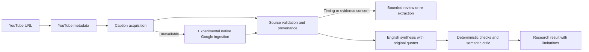

# YouTube Intelligence: native Google ingestion findings and reproducibility white paper

**Version:** 1.0 — 15 September 2026, Pacific/Auckland. UTC timestamps in artifacts may show 14 September.  
**Purpose:** decide whether native Google video ingestion can replace transcript services without sacrificing evidence quality, operational reliability or useful research output.  
**Status:** development experiment; no native source or candidate prompt has been promoted to production. Independent audio accuracy remains unmeasured.

## 1. Decision in brief

Native Google can return structured transcripts for our tested public YouTube videos, including a video for which the existing providers returned no captions. It therefore warrants continued evaluation as a captionless fallback. It has **not** established that we can retire the transcript services or promise 100% transcription success.

We observed four distinct classes of problem: API configuration rejection; requests whose outcome remains unknown after timeout; invalid generated timestamps; and exact-quote failures during downstream synthesis. These need different remedies. A successful request, a complete-looking timeline and a plausible trading report are three different results.

The follow-up work tested two shorter overlapping windows around the timestamp failure, two schema ablations, offline caption disagreement, and v5 synthesis on the retained native source. It also created a separate single-segment quotation candidate after the baseline revealed quote-boundary failures. Final counts and all request IDs are in the generated appendices below; every unsuccessful attempt is included.

**Present architecture decision:** retain caption retrieval and the evidence validation layer. Keep native Google experimental until source accuracy, prompt behaviour and hosted repeatability pass the gates in section 13. Native ingestion may simplify media acquisition; it does not remove the need for independently checked citations.

## 2. Product context and boundaries

The product is **YouTube Intelligence**, developed separately in leapedge-study for eventual integration under Finradar's Intelligence menu. The immediate scope is personal research with an eventual multi-user destination. English synthesis must support multilingual inputs and retain original-language evidence. Account, subscription, credits and billing-management product features remain outside the prototype scope.

The target experience is informed by LeapEdge: video analysis, channel research, structured ideas, citations, research history, digests, and experiments visible in Settings. The existing app uses Vercel, Neon and Resend. This experiment does not merge into Finradar, change production provider routing, or cancel any service.

Monthly infrastructure/API budget: NZ$500. This separately authorized native experiment has a **NZ$50 ceiling and 60 model-request ceiling**. Previous OpenRouter campaign accounting is not reset. No new LeapEdge analysis was submitted during this native campaign; earlier captured LeapEdge results serve as historical references.

“All findings” here means the available transcript-provider and native-ingestion evidence relevant to this decision, together with downstream source/synthesis tests. It does not mean every historical UI feature was re-tested in this campaign. The wider [ingestion plan](native-google-ingestion-plan.md), [provider comparison](transcript-provider-comparison.md), [audio accuracy protocol](transcript-accuracy-benchmark.md), and repository's completion documents remain companion records.

## 3. Questions and evidence hierarchy

| Hypothesis | Test | Meaning of a positive result | What it cannot prove |
|---|---|---|---|
| H1: native URL access works | Structured fileUri and public control video | This endpoint/model accepted and processed this request | Access to every public video or original audio track completeness |
| H2: captionless source acquisition improves | Two prior no-caption cases | Nonempty, structurally checked source returned where earlier providers failed | Exact speech or current comparative service uptime |
| H3: long-video acquisition is usable | 40:23 benchmark | Valid schema and bounded timeline across that source | Full word recall or all financial details |
| H4: clipping preserves usable coordinates | 60–120s English control; two macro windows | Absolute source coordinates observed in these outputs | Guaranteed coordinate semantics across models and future calls |
| H5: simpler schema resolves rejection | Saved failing schema minus/with smaller maxItems | Controlled evidence about that configuration change | A general cause of every INVALID_ARGUMENT response |
| H6: native text supports faithful synthesis | Frozen source, v5 prompts, deterministic quote checks, per-item critic | Text-supported draft items can survive this pipeline | Independent audio truth or parity with every LeapEdge claim |
| H7: explicit quote boundaries improve extraction | Same source and models, single-segment quotation guidance | Development-set change in boundary failures and audited items | General prompt superiority without repeats and held-out cases |
| H8: providers can be removed | Accuracy, repeatability, cost and hosted gates | A justified production routing decision | Absolute future reliability |

We distinguish five evidence levels:

1. **Documentation:** what the provider describes as supported. It motivates tests; it is not a measurement of our calls.
2. **API telemetry:** response/error, timing, model metadata, token counts and modality details. It establishes observable transport behaviour.
3. **Application checks:** JSON schema, source identity, timestamp bounds, exact quote/price/ticker checks. These are deterministic relative to retained data.
4. **Cross-output agreement:** captions versus model, full video versus clips, draft versus critic. Agreement may be correlated and is not ground truth.
5. **Independent audio reference:** a reviewer transcribes and anchors the actual audio without seeing candidates first. No such new reference was scored in this campaign.

Model statements about listening, language, completeness, missing speech or confidence remain assertions. Critic acceptance is text-audit acceptance, not human validation.

## 4. Documentation and web investigation

Research was performed before the final recommendation. The structured [source register](native-google-research-sources.json) records consulted URLs, source classes and relevance. [Snapshot metadata](native-google-source-snapshots.json) records capture times, byte counts and SHA-256 hashes; full HTML stays private under `data/native-google-20260915/web-references/`.

Initial Python archival requests failed certificate verification on this machine. Those 14 failures were preserved privately. Re-running with the system curl trust store captured all 14 pages without disabling TLS verification. This was a local documentation-archiving issue, not a Gemini API failure.

### 4.1 What the current sources establish

| Source | Relevant documented behaviour or reported issue | Consequence for our method |
|---|---|---|
| [Google GenerateContent video guide](https://ai.google.dev/gemini-api/docs/generate-content/video-understanding) | Structured YouTube fileData; public-video limits; default static processing; startOffset/endOffset; MM:SS prompt guidance; streaming for long requests | Use native media input and bounded clips. Our static results do not measure agentic behaviour. |
| [Google structured outputs](https://ai.google.dev/gemini-api/docs/structured-output) | A supported JSON Schema subset; large/complex schemas can be rejected; maxItems is documented; values still need application validation | A 20,000-item limit is a hypothesis to test, not a proven unsupported keyword. |
| [GenerateContent API reference](https://ai.google.dev/api/generate-content) | Distinct prompt blocking, finish reasons, token totals, thought counts and modality breakdowns | Do not turn nonzero prompt tokens or STOP into an accuracy assertion. |
| [Google troubleshooting](https://ai.google.dev/gemini-api/docs/troubleshooting) | Error codes require configuration/permission/quota diagnosis | Generic HTTP400 is not automatically “video unavailable.” |
| [Google URL Context](https://ai.google.dev/gemini-api/docs/url-context) | YouTube and audio/video files are unsupported by URL Context | URL Context is not the media acquisition mechanism being tested. |
| [YouTube captions.download](https://developers.google.com/youtube/v3/docs/captions/download) | OAuth and permission to edit the video are required; the method costs quota units | A normal YouTube metadata key does not provide arbitrary creators' caption downloads. |
| [Google audio guide](https://ai.google.dev/gemini-api/docs/audio) | Audio transcription examples and a separate dedicated speech-to-text offering | Gemini can be an acquisition candidate; choosing it over dedicated ASR requires evidence. |
| [js-genai issue #1318](https://github.com/googleapis/js-genai/issues/1318) | A developer reported generic INVALID_ARGUMENT with a Zod-derived schema on another SDK version | Similar symptom, not a confirmed explanation for our request. |
| [Timestamp drift report](https://discuss.ai.google.dev/t/bug-gemini-3-flash-and-3-1-pro-progressive-timestamp-drift-in-audio-transcription/129501) | First-person timing drift measurements and model-dependent tradeoffs | Independently measure time anchors; a better reasoning model need not yield better timings. |
| [Older timestamp issue](https://discuss.ai.google.dev/t/gemini-flash-2-0-audio-transcription-timestamps-incorrect/66777) | A forum response reported reproducing and escalating that user's example | Timing defects are not unique to our experiment, but no universal current fix follows. |
| [python-genai issue #1815](https://github.com/googleapis/python-genai/issues/1815) | Schema-path differences and maintainer guidance around response_json_schema | Do not generalize our workaround into a recommendation to abandon JSON Schema across SDKs. |
| [js-genai source](https://github.com/googleapis/js-genai/blob/main/src/models.ts) | Backward-compatibility handling can move a $schema-bearing responseSchema into responseJsonSchema | Verify serialized requests in the pinned installed SDK; mutable main is not our version lock. |
| [WhisperX](https://github.com/m-bain/whisperX) | Forced alignment and VAD with language-specific dependencies; documented numeric/overlap limitations | Potential timestamp alternative, but it needs actual media bytes and additional compute. It was not tested here. |

The video guide currently documents agentic MEDIA_PROCESSING tool-call/response parts for supported configurations. Earlier conversation statements that all GenerateContent navigation telemetry is unavailable were too broad. **Our measured calls were static and returned no verified agentic trace.** We have not implemented or validated agentic ingestion in this harness.

The guide's YouTube preview wording is not used to declare our model calls free. Accounting remains based on observed usage, recorded rates and unresolved invoice status.

### 4.2 Corrections to earlier implementation assumptions

- Direct YouTube media input is not the same thing as the Files API or URL Context. The native harness needs neither a local video download nor a Files upload for these tested URLs.
- Total prompt tokens include text instructions. Modality details are stronger evidence of media input but do not identify an accurate, complete original-audio transcript. Tokenization density is not network bitrate.
- Generated timestamps are data to validate, not guaranteed media offsets. We observed original coordinates in our clips, without establishing a universal contract.
- The earlier example code's schema and AbortSignal claims were not accepted on trust. The installed SDK, TypeScript checks, local HTTP fixture and actual response artifacts define this implementation.
- Static processing does not guarantee exhaustive transcription, and stronger reasoning does not guarantee more accurate citation timing. Our text comparisons demonstrate why both need measurement.
- No explicit context cache was created. We claim no caching savings or hard requests-per-minute allowance from generic model descriptions. Any future caching experiment needs its own observed usage and storage costs.

### 4.3 Search method and exclusions

Queries included `site.ai.google.dev Gemini video understanding YouTube timestamps startOffset endOffset transcription static`, `site.github.com/googleapis/js-genai responseJsonSchema YouTube INVALID_ARGUMENT timestamps`, `site.discuss.ai.google.dev video transcription incorrect timestamps youtube Gemini`, and `site.github.com/googleapis/js-genai/issues responseJsonSchema "$schema" 400`.

Official documentation, published SDK code and firsthand issue reports were prioritized. General social-media claims about how Gemini “really watches YouTube” were not adopted as architectural facts. Issue reports concern different videos, models, SDKs and dates; their role is hypothesis generation, not causal proof. No support message was sent for these new findings.

## 5. Corpus and prior provider baseline

| Video | Duration from YouTube metadata | Role |
|---|---:|---|
| SHMPiWbbR6E | 165s | Short English control; not a representative trading-setup benchmark |
| CMjt6f4eVdA | 779s | Mandarin trading commentary; prior caption providers returned unavailable |
| J25UuUqHT3Y | 1919s | Mandarin macro commentary; prior caption providers returned unavailable |
| wkAqHlYL7bQ | 2423s | Long English market commentary benchmark |
| 3u24qyWjSVM | 1005s | Mandarin commentary with mixed English tickers and numbers |

“Captionless” is shorthand for **no captions retrieved by our earlier tested routes**. It is not a claim that we proved the absence of every track inside YouTube. The Alpha duration differs by one second from BibiGPT's earlier debit/duration field; current independent metadata, not a provider debit value, defines this experiment's bounds.

The earlier [three-provider campaign](three-provider-repeat-results.json) made 54 requests: six videos, three rounds, three providers. Each provider retrieved four of six videos. Successful median request times were TranscriptAPI 768ms, Tapline 1204.5ms and Supadata 2881.5ms. These were local clients calling cloud APIs, not Vercel execution measurements. They are historical results, not same-minute A/B controls for Google.

[BibiGPT's five authenticated requests](bibigpt-live-results.json) returned HTTP200 throughout. Both no-caption cases had empty subtitles and were rejected by the application. The English text matched earlier TranscriptAPI text after normalization. The Mandarin outputs were repeatable but shortened seven QQQ occurrences to Q relative to those captions. These are comparative observations; no provider is an independently transcribed reference. Debit and latency are recorded even for unusable results.

The earlier [LeapEdge Alpha reference](leapedge-captionless-result.json) showed four ideas, nine key points, 88.6k tokens and a displayed $0.030. Its prompt label was `keypoints.v1-insights.v3-critique.v1`. That label establishes version identifiers, not its actual prompt text or internal implementation. Apple 258–260 appeared as Entry although the displayed supporting evidence described resistance. This is a product-output concern; it is not proof of the full video's accuracy. We retain faithful holdings/conditional views rather than optimizing to match a target idea count.

## 6. Runtime, credentials and reproducibility

The isolated package is [evaluations/native-google](../evaluations/native-google/README.md), pinned to `@google/genai` 2.22.0, Zod 4.5.4 and TypeScript 6.0.3. It uses Node's TypeScript stripping for execution and separate TypeScript checks. The package is excluded from application deployment dependencies. The application and Finradar are not rebuilt around the experiment.

`GEMINI_API_KEY` authenticates model requests. `YOUTUBE_API_KEY` fetches independent duration metadata. They are not interchangeable. Keys are loaded from ignored environment files, never placed in reports. Google API requests use the SDK; YouTube metadata uses an API-key header. Raw responses are private and redacted against supplied secrets before retention.

Historical implementation checkpoints: `35fadab` initial isolated harness; `740a95c` thinking-configuration correction; `a652f7c` funding blocker; `cb61fe1` first funded results and working responseSchema configuration. The current [script manifest](native-google-script-manifest.json) records file hashes. Mutable model IDs and future backend changes mean a reproducible method is not a guarantee of bit-identical generation.

### 6.1 Executed scripts

| Script | Function and status |
|---|---|
| `evaluations/native-google/core.ts` | Native request builder, validation, cancellation, error classification and usage estimates |
| `evaluations/native-google/runner.ts` | Metadata/model preflight and one named baseline case per explicit execution |
| `evaluations/native-google/journal.ts` | Reservation, duplicate guard, immutable response artifacts and terminal outcome retention |
| `work/native-google/minimal.ts` | Historical plaintext diagnostic; exact retained effective request is more authoritative than a later copy of this helper |
| `work/native-google/schema.ts` | Historical failing generated-schema diagnostic; helper depended on then-current core |
| `work/native-google/google-schema.ts` | Historical successful Google Type schema diagnostic |
| `evaluations/native-google/fixtures/rejected-schema-request.json` | Frozen request from the actual failed diagnostic, with nonserializable abort signal removed; no transcript or credential |
| `evaluations/native-google/followup-cases.ts` and `followup.ts` | Controlled schema changes and 90-second macro windows; default is dry-run |
| `evaluations/native-google/shadow-synthesis.ts` | Same retained Alpha source; existing v5 synthesis/extraction and per-item critique; optional separately labeled quotation candidate |
| `evaluations/native-google/text-budget.ts` | Model-specific conservative reservation for text-only calls |
| `evaluations/native-google/compare.mjs` | Offline edit disagreement and pending audio-review packet; no API requests |
| `evaluations/native-google/report.mjs` | Regenerates sanitized request results, shadow summaries and script hashes from private artifacts |
| `evaluations/native-google/snapshot-sources.py` | Archives public research pages privately and writes public hash/status metadata |
| `evaluations/transcript-accuracy.ts` | Shared token normalization, edit-count algorithm and refusal to score unreviewed audio references |
| `work/native-google/save.ts` | Earlier Settings save/readback helper |
| `scripts/save-native-google-research.ts` | Saves and reads back the white paper, benchmarks, prompt alias and improvement record without changing defaults |
| `evaluations/native-google/shadow-prompts.ts` | Reconstructs both executed prompts; regression tests verify their exact live-run hashes |
| `evaluations/native-google/whitepaper-appendix.mjs` | Generates this paper’s complete ledger, token and A/B tables |

Historical helper hashes are labeled as hashes **at report time**. In particular, re-running an old helper after changing core.ts would not necessarily reproduce the original request. Saved effective requests and versioned commits are the authoritative reconstruction inputs. This limitation is recorded rather than hidden.

### 6.2 Reproduction commands

Run from the repository root after installing the pinned application and isolated dependencies. Re-generating reports is offline. Live commands create new potentially billable requests and require available campaign headroom; duplicate configurations deliberately stop.

```sh
npm ci --prefix evaluations/native-google --ignore-scripts
npm --prefix evaluations/native-google run typecheck
npm --prefix evaluations/native-google test

# Preflight: no model generation
node --env-file=.env --experimental-strip-types evaluations/native-google/runner.ts english
node --experimental-strip-types evaluations/native-google/followup.ts macro-window-a

# Explicit live request examples, subject to journal guards
node --env-file=.env --experimental-strip-types evaluations/native-google/runner.ts alpha --execute
node --env-file=.env --experimental-strip-types evaluations/native-google/followup.ts macro-window-a --execute
node --env-file=.env --experimental-strip-types evaluations/native-google/shadow-synthesis.ts --execute
node --env-file=.env --experimental-strip-types evaluations/native-google/shadow-synthesis.ts --single-segment-quotes --execute

# Offline regeneration requires private source artifacts retained in this workspace
node --experimental-strip-types evaluations/native-google/compare.mjs
node --experimental-strip-types evaluations/native-google/report.mjs
```

Do not delete the ledger to force a rerun. A new repeat needs an explicit experiment identity, preserved prior evidence and remaining budget. The only existing automatic retry path is **none**; the quota retry mechanism requires an explicit link to a matching prior quota rejection. Timed-out requests are not automatically resubmitted.

## 7. Acquisition and failure methodology

The successful baseline request uses structured `fileData.fileUri`, Google `responseSchema`, JSON response MIME, a 32,768 output cap and provider-default thinking/media resolution. It leaves mediaProcessing unset, relying on documented default static processing. Clips add only startOffset/endOffset to the video part. The source-only prompt preserves original language, words, numbers, repeated ticker letters and negation; requests chronological short segments; disallows translation, inferred chart speech and invented words; and asks for original-video seconds.

Runtime schema checks source ID, finite nonnegative timestamps, nonempty segment text and reported omissions. Application checks ordered starts, start/end order, source duration and requested-window bounds. A gap or missing tail over 30 seconds triggers review; it does not assert missing speech because that interval could contain silence. Timeline coverage is the union of intervals divided by requested duration. It is not a transcript-completeness score.

The failure taxonomy separates missing credentials, quota/access errors, generic API errors requiring diagnosis, uncertain transport/timeout, prompt blocking, missing candidates, output truncation, malformed JSON, invalid schema, wrong source, empty transcript, bad timestamps, review-required output and structurally valid unverified output. API safety blocks are not reclassified as inaccessible media. The deadline abort signal reaches the actual SDK request. Local cancellation does not prove the provider stopped work or that no charge occurred.

All model attempts reserve budget before submission. Successful responses, explicit errors and uncertain timeouts retain their reservations until reconciliation. The default media reservation is NZ$2.50. Acquisition/diagnostic work uses a cumulative NZ$35 phase cap; later text review can use the remaining campaign allocation without resetting earlier reservations.

Text reservations use UTF-8 byte count plus 4096 overhead as a conservative input bound, the configured output cap plus a second equal thought allowance, dated model rates, a NZ$2/US$1 conversion assumption and 25% margin, rounded up to cents with a NZ$0.10 minimum. These are guards, not invoices or a market FX quote. The common journal enforces the NZ$50/60-request caps for both kinds of request.

## 8. Acquisition findings and attempted remedies

The initial English request failed because prepaid credits were depleted. Its explicit linked funded retry returned HTTP400 with the original configuration. A minimal plaintext native-video request succeeded. Adding the original generated JSON schema failed again. A simpler manually declared Google responseSchema succeeded. This established a working configuration but did not isolate every schema keyword or SDK/backend interaction.

Full static acquisition then returned valid structures for the English control, Alpha, the long benchmark and the Mandarin benchmark. Macro returned 199 segments but one end time was 2016.14 seconds, beyond the 1919-second video. The source was rejected; no plausible replacement time was invented.

### 8.1 Local window result

We tested 1170–1260s and 1200–1290s with a 60-second overlap. No full-video draft or suggested corrected timestamp was supplied to either request. Both passed structural checks in 12.781s and 7.031s, respectively. Each reported 8191 VIDEO tokens plus 154 TEXT tokens, compared with 174626 VIDEO tokens in the full macro request.

The matching passage that ended at 2016.14s in the full output ended at 1221.78s in the first clip and 1221.72s in the second. This supports local re-extraction as a candidate recovery mechanism. It does **not** prove the new time is correct to 0.06s. That number measures disagreement between two generated answers. Segment boundaries and filler words also differ.

No full-video source was patched automatically. A deployable repair requires overlap alignment, handling duplicated/cross-boundary claims, preserving old and replacement intervals, and independent review of critical evidence. Small successful clips do not prove that a complete long video can be transcribed losslessly by stitching.

### 8.2 Schema ablations

The frozen failing JSON schema included maxItems=20000, nullable fields, required fields, nonnegative time constraints, additionalProperties=false and a draft declaration. Two follow-up requests changed only maxItems: removal, and reduction to 500. Unit tests compare the complete constructed request against the frozen request to enforce this control.

Both follow-ups timed out at approximately 180 seconds without a usable response. They therefore establish neither a successful fix nor proof that JSON Schema is unsupported. The original generic rejection changed to an unresolved outcome, with no field-specific diagnostic. The manual Google Type schema remains the empirically working configuration in this corpus. Further expensive schema experiments were stopped; the two uncertain reservations were retained.

Other potential resolutions considered but not tested here: smaller field-by-field schemas; a current supported response-format API with pinned serialization tests; MM:SS string outputs converted deterministically to seconds; streaming; explicit static versus agentic comparison; lower-cost model timing extraction; dedicated ASR plus forced alignment. Each changes different variables and needs its own controls.

## 9. Text comparison and synthesis methodology

### 9.1 Offline caption disagreement

The comparison script uses the existing `audio-reference.v1` normalization and linear-memory edit-count implementation. English is tokenized into words while preserving financial punctuation; Chinese is compared by normalized characters without simplified/traditional conversion. Historical TranscriptAPI captions are the baseline **for disagreement only**.

| Case | Baseline units | Native units | Edit differences | Difference / baseline |
|---|---:|---:|---:|---:|
| English control | 401 | 395 | 17 | 4.24% |
| Long English | 7472 | 6520 | 1185 | 15.86% |
| Mandarin | 3783 | 4145 | 961 | 25.40% |

The long result includes 968 deletions relative to captions; the Mandarin result includes 603 insertions. These may include real omissions, caption errors, punctuation/tokenization effects or differing speech handling. They cannot be reported as true WER/CER against audio. Google showed eight exact QQQ occurrences where the historical caption text had seven; preserving QQQ's spelling does not establish occurrence-level correctness.

The [comparison artifact](native-google-comparison-results.json) contains component edit counts, hashes, normalizer version and review windows. Nine development audio windows cover the English naming discrepancy; Alpha Bitcoin, Tesla and Apple levels; the macro timestamp; long-video beginning/middle/end; and Mandarin tickers. Fourteen candidate excerpts remain pending boundary/audio review. The private packet contains no fabricated reviewer identity, reference text or accuracy scores.

### 9.2 Frozen-source v5 baseline

The Alpha transcript was held constant. Existing v5 synthesis and extraction prompts were combined exactly as in the current application, using its source chunking, Claim schema, deduplication, evidence anchoring and deterministic validation. Each structurally valid item then received the current per-item critique prompt and context selection.

Synthesis model: Gemini 3.8 Flash. Critic: Gemini 3.5 Flash. Transport: native GenerateContent, rather than the production OpenRouter transport. The model identities and prompt text match the intended baseline; transport/inference translation is a stated difference. Synthesis uses temperature zero and a 16,000 output cap; critique uses temperature zero, low thinking and a 3,000 cap. Source and prompt hashes are retained. Exact stochastic equivalence with OpenRouter is not claimed.

The baseline produced seven claim drafts and two key-point drafts. Eight failed exact-source checks before critique; one claim reached and passed text critique. A major failure pattern was adding spaces while joining adjacent segment text. The baseline is retained unchanged, including all rejected drafts. It is not equivalent to a seven-idea accepted report.

### 9.3 Quotation candidate

The candidate adds only evidence-serialization instructions to v5: each quote must be an exact substring of one segment; use separate evidence records when multiple segments support a claim; do not concatenate, add boundary spaces or rewrite punctuation. It retains the same source text, models, output caps and critic prompt. Its version is `evidence-first.web.v5+single-segment-quotes.v1`.

This is a post-baseline development experiment, not a blinded or held-out evaluation. The source is not altered to make the draft pass. Final candidate counts, individual text verdicts and remaining mismatches appear in the generated appendix and [shadow results](native-google-shadow-results.json). Prompt improvement is assessed separately from the underlying transcript's audio accuracy. No default prompt has changed. The Settings catalog stores the identical prompt text under `evidence-first.web.v5-single-segment-quotes.v1` because its ID validator does not accept `+`; the original execution ID and hash remain unchanged in the results.

### 9.4 LeapEdge comparison limits

The saved reference is a useful UX and content comparator, not ground truth. Our classification separates existing holdings, new entries, support/resistance and educational context. A larger idea count can represent better coverage, duplicates or over-extraction; a smaller accepted count can reflect stricter evidence checks or missed information. Both false positives and omissions need scoring against reviewed source expectations.

The Alpha draft correctly treated Apple 258–260 as resistance, unlike the captured LeapEdge field. That is a favourable classification observation, but it does not establish overall superiority. Per-item critics can still accept debatable level roles, and source text may itself be wrong. Costs displayed by LeapEdge cover unknown internal stages and models, so they are not directly comparable with our acquisition-only cost.

## 10. Cost and reliability interpretation

Recorded Gemini 3.8 Flash standard rates are US$0.75/M input and US$3.75/M output including thinking through 31 December 2026. The pricing page lists higher rates from January 2027. The 3.5 Flash critic is estimated at US$1.50/M input and US$9/M output. Recheck rates before later experiments. [Google pricing](https://ai.google.dev/gemini-api/docs/pricing).

An estimate is emitted only when required usage fields are present. Omitted thought counts are not silently treated as zero. The report separately provides arithmetic on observed prompt/candidate components where possible, with its limitations labeled. Total token arithmetic can suggest omitted zero thoughts, but does not reconcile billing, cache discounts, service tiers or failed requests.

The first ten requests had US$0.501678 in known estimates and NZ$25 held reservations. The appendices update totals for follow-up and shadow calls. Do not sum only successful calls and call that the cost per usable video. A production estimate must include failed/uncertain acquisition, repair, synthesis, critique, hosted execution, storage, provider minimum plans, FX and fees.

The corpus is small, selected and adaptively investigated. It combines different configurations, intervals and tasks. A pooled “success rate” would be misleading, and repeated calls minutes apart are not a cloud uptime study. No 100% claim, statistical generalization or seven-day/100-video observation result is made.

## 11. Architecture implications



| Component | If native tests eventually pass | Current decision |
|---|---|---|
| OpenRouter media ingestion | Native Google may replace this media-specific route | Retain production behaviour until hosted candidate is verified |
| Paid transcript/ASR fallbacks | Could reduce active providers and associated subscriptions | Do not cancel; no total-replacement proof |
| Fast caption retrieval | Optional only after cost/latency/accuracy comparison | Retain: historical caption retrieval was much faster |
| Downloads/proxies/Python ASR worker | Potentially avoid for supported public-video inputs | Not required by the native harness; dedicated alignment would reintroduce media handling |
| YouTube Data API | Metadata, discovery and duration remain useful | Retain |
| Vercel, Neon and durable jobs | Provider-neutral product infrastructure | Retain; this is not a hosting migration |
| Source versions, logs and budget guards | Essential for failures, review and rollback | Retain |
| Quote validation and semantic critique | Required even with multimodal ingestion | Retain and improve evidence serialization |
| Vector database/RAG | May help cross-video search later | Not required to solve ingestion or verify one video's quotes |
| Resend and digests | Independent of acquisition mechanism | Retain |

Native Google reduces the number of integrations only if its unresolved cases can be handled acceptably. A sole provider also concentrates outages, model changes and pricing exposure. That tradeoff should be evaluated from observed traffic, not inferred from the vendor's scale.

## 12. Tests, artifacts and known limitations

Fifteen controlled tests and isolated TypeScript checks pass. The controlled suite covers real SDK serialization to a local HTTP fixture, no SDK retry after HTTP503, connected abort, malformed/empty/truncated output, source identity, timing bounds, gap flags, missing usage, journal uniqueness, explicit quota retry, schema-only request changes, clip overlap and text reservation accounting. Passing these tests validates harness behaviour; it does not validate the original videos.

CI initially failed at revision `927173b`: the native job installed only its isolated package, but shadow synthesis reuses application contracts that resolve Zod from the root package. The workflow was corrected to install both pinned dependency sets. [CI run 34892975548](https://github.com/JoshuAI-888/leapedge-study/actions/runs/34892975548) passed both jobs at `4929280`, including application tests/typecheck/build/audit and isolated typecheck/tests/audit. This was a CI dependency-setup failure, not a model or transcription failure. The [validation record](native-google-validation-results.json) also records raw-hash, link, secret-scan and Settings readback checks. Paid experiments were not repeated by CI.

Every raw model artifact is private, uniquely named and hashed. Sanitized public reports retain request identity, input interval, prompt/model/configuration, timing, usage, outcome, cost uncertainty and artifact hashes. Shadow reports omit full original-language transcripts/quotes and retain outcome summaries. Settings stores the benchmark and prompt-improvement results with source/prompt hashes.

Remaining methodological limits include no independent audio ground truth; no complete visual-chart OCR evaluation; no live inaccessible/private-video negative controls; no controlled original-audio-versus-caption track manipulation; no all-language guarantee; no agentic/static A/B; no repeated hosted shadow campaign; no independent invoice reconciliation; and no current LeapEdge rerun for the new candidate. All existing corpus cases are development cases.

## 13. Next decision gates

1. **Audio adjudication:** independently review the nine prepared windows, then freeze new held-out cases. Score actual financial numbers, issuer/ticker occurrences, negations, conditions and timestamps. Provider consensus cannot replace this step.
2. **Timestamp recovery:** verify the macro local outputs against audio, then test overlap merging without invented times or silent source replacement. Keep original and replacement source versions.
3. **Prompt replication:** repeat baseline/candidate comparison on additional videos, preserving the same source/model settings. Record quote failures, unsupported clauses, accepted claims and missed reviewed claims, not only output counts.
4. **Hosted shadow:** run bounded jobs on the intended host, record timeout/resume behaviour, usage, cost per accepted result and safe failure UX. Continue serving the established route during observation.
5. **Promotion:** require zero unflagged material financial errors on the reviewed acceptance set and at least 95% reviewed citation anchors within two seconds, counting missing anchors in the denominator. These are targets, not achieved results.
6. **Provider retirement:** only after the approved plan's representative observation period, rollback rehearsal and cost review. Keep old adapters recoverable and historical artifacts accessible. The existing plan calls for at least seven days and 100 representative eligible videos; this campaign does not satisfy that gate.

If independent review cannot be supplied, the honest output is a structurally checked, text-supported **unverified research aid**, not a verified trading-evidence product. That distinction must remain visible in both reports and Settings.

## 14. Machine-generated result appendices

The following appendices are generated from retained artifacts. They distinguish acquisition from synthesis/critique, preserve failures and show the terminal state at this white paper's publication. Regeneration scripts and hashes are listed above.

<!-- GENERATED_RESULTS -->

### A. Complete request ledger

Recorded requests: **25**. Terminal local outcomes: **25**. Held reservations: **NZ$37.86 / NZ$50**. Known estimates: **US$0.604299**, with **15 unknown-cost attempts**. A terminal local timeout still has uncertain upstream completion/billing.

| Attempt ID | Case/stage | Result | Seconds | Segments | Estimate US$ | Held NZ$ |
|---|---|---|---:|---:|---:|---:|
| 10ba7b31-e1ff-4120-93e2-a512134e44a5 | SHMPiWbbR6E | quota_or_rate_limit | 0.345 | — | unknown | 2.50 |
| eb6fb3c1-3a19-40e2-9416-f24a0b39576a | SHMPiWbbR6E | api_error_requires_diagnosis | 11.364 | — | unknown | 2.50 |
| faa76fc7-3b3a-4cc6-a39f-fb511484b3fd | minimal-file-uri.v1 | diagnostic_text_received | 11.172 | — | 0.019842 | 2.50 |
| 6df01eb9-f4ca-410d-a4a7-262d9f31be6f | minimal-plus-original-schema.v1 | api_error_requires_diagnosis | 5.597 | — | unknown | 2.50 |
| 2acd7054-a4f3-4aae-875e-972f7c44dc5d | minimal-google-schema.v1 | structurally_valid_unverified | 12.499 | 39 | 0.020540 | 2.50 |
| 4e93d949-2083-43e3-98f5-fea6b133a4ad | CMjt6f4eVdA | structurally_valid_unverified | 31.030 | 110 | unknown | 2.50 |
| 58f33c11-2036-42e7-8d8c-b4a5f0b9e02c | J25UuUqHT3Y | invalid_timing_or_coordinate_system | 89.152 | 199 | 0.190205 | 2.50 |
| ce8cb5e5-de59-4e95-9925-8670e43e9a37 | SHMPiWbbR6E | structurally_valid_unverified | 7.976 | 15 | 0.011339 | 2.50 |
| 0df6588a-cad3-411f-9202-12aac1c57495 | wkAqHlYL7bQ | structurally_valid_unverified | 80.157 | 348 | 0.259751 | 2.50 |
| fe349e23-40c9-4f38-986d-a252a6591b96 | 3u24qyWjSVM | structurally_valid_unverified | 42.559 | 51 | unknown | 2.50 |
| 6b8eeeac-3add-4215-a839-04117f802fe7 | schema-no-max | transport_uncertain_timeout | 180.008 | — | unknown | 2.50 |
| 2acff7f9-64dc-47af-91db-d5f681735dfd | macro-window-a | structurally_valid_unverified | 12.781 | 42 | unknown | 2.50 |
| dd779b84-cc28-472a-a67c-31479490f216 | macro-window-b | structurally_valid_unverified | 7.031 | 19 | unknown | 2.50 |
| 40bf97a3-db3a-460f-8aec-69ddde5088c9 | schema-small-max | transport_uncertain_timeout | 180.006 | — | unknown | 2.50 |
| 340bb8f5-307d-4b3d-81f4-8a007c36cfed | synthesis | text_stage_unverified | 21.907 | — | 0.030066 | 0.35 |
| 444f41bb-b635-43a4-a410-0cf569a71202 | critique-item-4 | text_stage_unverified | 1.861 | — | unknown | 0.24 |
| 4c3e25b0-64bb-4edc-9d87-fe2e0995651f | synthesis | text_stage_unverified | 22.537 | — | 0.026553 | 0.35 |
| 44f9ce21-058a-49ea-a293-47f284936e2b | critique-item-2 | text_stage_unverified | 2.106 | — | unknown | 0.24 |
| 37791d63-ceb8-453a-9618-0f78b9fac93f | critique-item-3 | text_stage_unverified | 1.946 | — | unknown | 0.24 |
| fee32449-734b-4a53-99c0-5b46c798e939 | critique-item-4 | text_stage_unverified | 2.501 | — | unknown | 0.24 |
| dfc97a2f-cf60-494f-8873-2d3b574ceebc | critique-item-5 | text_stage_unverified | 2.467 | — | unknown | 0.24 |
| 5a3b82c7-d6f9-4186-9b07-ff9311fb47cb | critique-item-6 | text_stage_unverified | 2.653 | — | 0.013282 | 0.24 |
| 2606ce09-9f10-49be-883d-55df8d747635 | critique-item-7 | text_stage_unverified | 4.170 | — | 0.016854 | 0.24 |
| eeb27b5b-d471-4c0e-9a24-b4f50f4b806d | critique-item-8 | text_stage_unverified | 3.370 | — | 0.015866 | 0.24 |
| 345609bc-898e-4f8d-9cc7-509488278d6d | critique-item-9 | text_stage_unverified | 1.879 | — | unknown | 0.24 |

### B. Token telemetry

Unknown thought counts are deliberately shown as unknown. No AUDIO-versus-caption completeness claim is inferred from these fields.

| Attempt ID | Prompt | Candidate | Thought | Total | Input modality detail |
|---|---:|---:|---:|---:|---|
| 10ba7b31-e1ff-4120-93e2-a512134e44a5 | unknown | unknown | unknown | unknown | unknown |
| eb6fb3c1-3a19-40e2-9416-f24a0b39576a | unknown | unknown | unknown | unknown | unknown |
| faa76fc7-3b3a-4cc6-a39f-fb511484b3fd | 15041 | 1422 | 861 | 17324 | VIDEO:15013, TEXT:28 |
| 6df01eb9-f4ca-410d-a4a7-262d9f31be6f | unknown | unknown | unknown | unknown | unknown |
| 2acd7054-a4f3-4aae-875e-972f7c44dc5d | 15052 | 2417 | 50 | 17519 | TEXT:39, VIDEO:15013 |
| 4e93d949-2083-43e3-98f5-fea6b133a4ad | 70956 | 6385 | unknown | 77341 | VIDEO:70809, TEXT:147 |
| 58f33c11-2036-42e7-8d8c-b4a5f0b9e02c | 174777 | 15662 | 104 | 190543 | VIDEO:174626, TEXT:151 |
| ce8cb5e5-de59-4e95-9925-8670e43e9a37 | 5609 | 941 | 961 | 7511 | TEXT:148, VIDEO:5461 |
| 0df6588a-cad3-411f-9202-12aac1c57495 | 220560 | 25059 | 96 | 245715 | TEXT:149, VIDEO:220411 |
| fe349e23-40c9-4f38-986d-a252a6591b96 | 91603 | 5528 | unknown | 97131 | VIDEO:91453, TEXT:150 |
| 6b8eeeac-3add-4215-a839-04117f802fe7 | unknown | unknown | unknown | unknown | unknown |
| 2acff7f9-64dc-47af-91db-d5f681735dfd | 8345 | 2435 | unknown | 10780 | TEXT:154, VIDEO:8191 |
| dd779b84-cc28-472a-a67c-31479490f216 | 8345 | 1276 | unknown | 9621 | VIDEO:8191, TEXT:154 |
| 40bf97a3-db3a-460f-8aec-69ddde5088c9 | unknown | unknown | unknown | unknown | unknown |
| 340bb8f5-307d-4b3d-81f4-8a007c36cfed | 6438 | 4403 | 2327 | 13168 | TEXT:6438 |
| 444f41bb-b635-43a4-a410-0cf569a71202 | 7058 | 143 | unknown | 7201 | TEXT:7058 |
| 4c3e25b0-64bb-4edc-9d87-fe2e0995651f | 6514 | 4649 | 1129 | 12292 | TEXT:6514 |
| 44f9ce21-058a-49ea-a293-47f284936e2b | 7041 | 158 | unknown | 7199 | TEXT:7041 |
| 37791d63-ceb8-453a-9618-0f78b9fac93f | 7091 | 120 | unknown | 7211 | TEXT:7091 |
| fee32449-734b-4a53-99c0-5b46c798e939 | 6778 | 93 | unknown | 6871 | TEXT:6778 |
| dfc97a2f-cf60-494f-8873-2d3b574ceebc | 6918 | 108 | unknown | 7026 | TEXT:6918 |
| 5a3b82c7-d6f9-4186-9b07-ff9311fb47cb | 6839 | 88 | 248 | 7175 | TEXT:6839 |
| 2606ce09-9f10-49be-883d-55df8d747635 | 6904 | 103 | 619 | 7626 | TEXT:6904 |
| eeb27b5b-d471-4c0e-9a24-b4f50f4b806d | 6899 | 106 | 507 | 7512 | TEXT:6899 |
| 345609bc-898e-4f8d-9cc7-509488278d6d | 6894 | 95 | unknown | 6989 | TEXT:6894 |

### C. Synthesis A/B result

| Variant | Draft claims | Draft key points | Structural rejects | Text critic accepts | Accepted claims / key points |
|---|---:|---:|---:|---:|---|
| evidence-first.web.v5 | 7 | 2 | 8 | 1 | 1 / 0 |
| evidence-first.web.v5+single-segment-quotes.v1 | 6 | 3 | 1 | 8 | 5 / 3 |

The baseline and candidate each have one synthesis sample, with different resulting draft contents. This is a development A/B, not a statistically isolated causal estimate. Eight candidate items passed model text critique; one of those subsequently received the additional semantic review flag below. No item is independently audio verified.

| Candidate finding | Review layer | Status |
|---|---|---|
| Draft adds a closes-below condition; retained source describes breaking below. The model critic accepted it without flagging the added bar-close condition. | assistant_review_against_retained_text | requires_semantic_review |
| SPY claim rejected because the quoted evidence omitted the explicit ticker occurrence. No automatic symbol repair. | deterministic_validation | rejected |
| Separate QQQ/IWM holding guidance from baseline is absent as a separate candidate claim. Counts do not establish recall parity. | draft_to_draft_comparison | requires_recall_review |

### D. Data and script references

- [Full sanitized attempt record](native-google-live-results.json)
- [Caption disagreement and pending review windows](native-google-comparison-results.json)
- [Per-item baseline/candidate results](native-google-shadow-results.json)
- [Research source register](native-google-research-sources.json)
- [Archived source hashes](native-google-source-snapshots.json)
- [Executable script hashes](native-google-script-manifest.json)
- [Original first-funded assessment, with follow-up notice](native-google-live-assessment.md)

Private immutable response files are located under `data/native-google-20260915/{attemptId}.json`; raw hashes in the public JSON allow verification without publishing transcripts. The pending audio packet is `data/native-google-20260915/audio-review-packet.json`. No keys or full raw model responses are included in this white paper.
