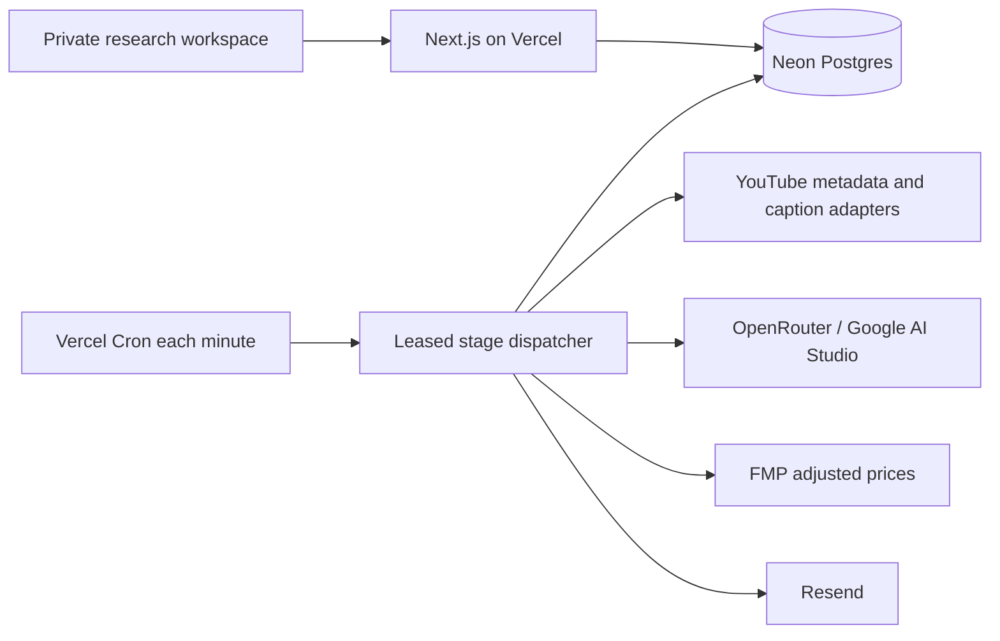

# Production deployment and operations

Updated 14 September 2026. This replaces the earlier local/Docker deployment proposal.

## Deployed architecture

The standalone private workspace is live at https://youtube-intelligence-two.vercel.app on the existing JoshuAI Vercel team, with a separate Neon database. Finradar production was not modified.



Vercel serves the UI and Node API. Cron invokes `/api/cron/intelligence` with `CRON_SECRET`. Each invocation processes a bounded window; a stage checkpoints in Postgres. Jobs have ten-minute leases and fencing tokens. Transactional locks protect deduplication, reservations and scheduler claims. Provider responses are retained before publication. An ambiguous network outcome stops paid retry and retains its reservation.

The app stores sources, reports, prompt snapshots, comparisons, reviews, deliveries, shares, discoveries and performance observations in nine `yi_*` tables. This is a single-workspace lab. Adopt Finradar's owner-scoped auth and platform task/database adapters before multi-user integration.

## Configuration

Use `.env.example` for variable names. Hosted configuration includes `DATABASE_URL`, `YTI_APP_ORIGIN`, a strong `YTI_ACCESS_TOKEN`, `CRON_SECRET`, provider credentials, recipient/sender and delivery enablement. Credentials stay in encrypted Vercel variables and ignored local environment files. Never expose them through `NEXT_PUBLIC_*`.

The configured canonical origin must exactly match the deployment alias; signed sessions and cross-origin checks depend on it. The workspace passcode is stored locally in ignored `.env.hosted`. A session expires after twelve hours. Public reports require an unguessable capability URL and expire after seven days; revocation is immediate.

Channel automatic analysis and daily delivery remain opt-in in Settings. Enabling global discovery does not itself enable every channel's paid analysis. The dispatcher examines at most three due channels per sweep, with an hourly pull cadence, and analyzes at most three new uploads per eligible channel per pull.

Resend test submission succeeded. Mailbox receipt and live delivery-event verification are separate acceptance steps. Configure `/api/email/webhook` in Resend and store its signing secret as `RESEND_WEBHOOK_SECRET` for authenticated delivery/bounce events. The supplied sending-only key cannot inspect domains or delivery status. Webhook signature, timestamp and deduplication behavior is tested locally.

## Budget

The task budget is NZ$500/month. The current research ledger is capped at US$15 cumulatively for this test campaign, including conservative unknown-call reservations. It does not implement monthly rollover. The OpenRouter account balance, Vercel plan, Neon usage and Resend quotas are separate. Reuse Finradar's monthly budget service when integrating. Prefer retained transcripts and text-only A/B variants to repeat video ingestion.

## Backup and recovery

```sh
node --env-file=.env --experimental-strip-types scripts/export-research.ts
# Restore only into an empty, isolated destination configured through DATABASE_URL or YTI_DB_PATH:
node --experimental-strip-types scripts/restore-research.ts PATH_TO_BACKUP.json
```

Exports include SHA-256 integrity and all table rows. Restore refuses nonempty destinations and verifies counts inside a transaction. A real Neon export was restored successfully to both isolated SQLite and Postgres on 14 September. Keep exports private: they contain research, provider responses and share snapshots. Schedule encrypted off-host exports in the eventual Finradar operations system; do not assume a specific managed-backup retention period without checking the chosen Neon plan.

For code rollback, promote the previous Vercel deployment. For data recovery, restore to a new database, verify, then change the app connection. Never blindly overwrite the live database. SQLite-to-Postgres migration is implemented in `scripts/migrate-sqlite.ts` and was verified with row counts.

## Delivery checks

`npm test`, type checking, production build, production dependency audit, isolated Postgres concurrency checks and hosted API tests have been run. Hosted tests cover private access, persisted settings and idea state, frozen sharing/revocation, cron authentication and cross-origin rejection. See the completion report for current evidence and remaining external constraints.

The local worker uses the same dispatcher as hosted Cron. Promptfoo lives in `evaluations/tooling`, which is excluded from Vercel deployment. Python research scripts are historical development tools, not runtime dependencies.

## Managed caption providers (14 September 2026)

Production-only encrypted variables: `SUPADATA_API_KEY`, `TRANSCRIPTAPI_API_KEY`, `YTI_GENERATED_TRANSCRIPTS=true`, and `YTI_TRANSCRIPT_CREDIT_BUDGET=90`. The credit cap is cumulative per provider for this test campaign, not a rolling monthly reset. Increase it deliberately after reconciling provider usage. It counts recorded reservations conservatively, including uncertain requests; API account usage remains the billing authority.

Retrieval tries Supadata native captions, TranscriptAPI native captions, the free YouTube.js adapter, then explicitly enabled Supadata generation. The existing Gemini video fallback remains last. Sources are cached by provider, mode, video and requested language. ASR generation detects spoken language rather than translating toward metadata language preferences. Supadata requests are paced across workers at 1.1-second intervals for the free plan. Explicit temporary HTTP failures can be retried up to three submissions on later invocations; ambiguous transport failures are not automatically resubmitted. Asynchronous job IDs are retained and polled rather than recreated.

Provider attempts, HTTP/error categories, runtime origin and credit reservations appear in the evaluation settings. The authenticated `captionProbe` research action tests a native provider without invoking a model. Transcript text and secrets are not returned by this diagnostic action. Native-caption retrieval availability is not a guarantee of accurate or complete transcription, nor of synthesis quality.

The 50-video cloud test retrieved captions for 40 videos. Both managed providers and an independent local caption-library check found no tracks for the remaining ten in this test window. Supadata generation returned HTTP 403 for the tested captionless macro and a short control; the control's detailed response reported an age restriction requiring authentication. A paid plan upgrade has not been established as the fix. Do not infer a 100% end-to-end success rate from the integration or native-caption coverage.
