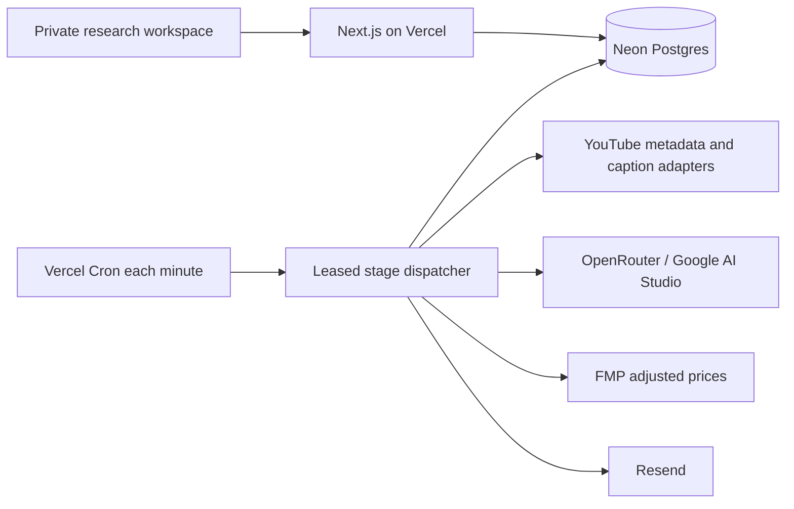

# Production deployment and operations

Updated 18 September 2026. This replaces the earlier local/Docker deployment proposal.

## Deployed architecture

The standalone private workspace is live at https://youtube-intelligence-two.vercel.app on the existing JoshuAI Vercel team, with a separate Neon database. Finradar production was not modified.



Vercel serves the UI and Node API. Cron invokes `/api/cron/intelligence` with `CRON_SECRET`. Each invocation processes a bounded window; a stage checkpoints in Postgres. Jobs have ten-minute leases and fencing tokens. Transactional locks protect deduplication, reservations and scheduler claims. Provider responses are retained before publication. An ambiguous network outcome stops paid retry and retains its reservation.

The app stores sources, reports, prompt snapshots, comparisons, reviews, deliveries, shares, discoveries and performance observations in nine `yi_*` tables. This is a single-workspace lab. Adopt Finradar's owner-scoped auth and platform task/database adapters before multi-user integration.

## Configuration

Use `.env.example` for variable names and `src/server/youtube-intelligence/env.ts` for the authoritative schema. Hosted configuration includes `DATABASE_URL`, `DATABASE_URL_UNPOOLED`, `YTI_PRODUCTION_DB_HOST`, `YTI_APP_ORIGIN`, a strong `YTI_ACCESS_TOKEN`, `CRON_SECRET`, provider credentials, recipient/sender and delivery enablement. `missingRequiredHosted()` lists whichever of those hosted keys is unset, by name, and `/api/intelligence/status` returns that list as `missingHosted`. Credentials stay in encrypted Vercel variables and ignored local environment files. Never expose them through `NEXT_PUBLIC_*`.

Optional operational variables: `YTI_POOL_MAX` (clients per serving instance, default 4), `YTI_QUEUE_PAUSED` (declared for the drain sequence below; the dispatcher's own check on it is not wired yet), `YTI_PREVIEW_READ_ONLY`, `YTI_BUDGET_USD`, `YTI_TRANSCRIPT_CREDIT_BUDGET`, `RESEND_WEBHOOK_SECRET`.

Errors and reports name keys, never values. Keep it that way: a message that quotes a connection string ends up in a build log.

The configured canonical origin must exactly match the deployment alias; signed sessions and cross-origin checks depend on it. The workspace passcode is stored locally in ignored `.env.hosted`. A session expires after twelve hours. Public reports require an unguessable capability URL and expire after seven days; revocation is immediate.

Channel automatic analysis and daily delivery remain opt-in in Settings. Enabling global discovery does not itself enable every channel's paid analysis. The dispatcher examines at most three due channels per sweep, with an hourly pull cadence, and analyzes at most three new uploads per eligible channel per pull.

Resend test submission succeeded. Mailbox receipt and live delivery-event verification are separate acceptance steps. Configure `/api/email/webhook` in Resend and store its signing secret as `RESEND_WEBHOOK_SECRET` for authenticated delivery/bounce events. The supplied sending-only key cannot inspect domains or delivery status. Webhook signature, timestamp and deduplication behavior is tested locally.

## Database connections

Two variables, two endpoints, one Neon branch.

| Variable | Endpoint | Used by |
| --- | --- | --- |
| `DATABASE_URL` | pooled — its host carries `-pooler` | every Next.js function, including the cron route |
| `DATABASE_URL_UNPOOLED` | direct | `npm run migrate`, `npm run db:check`, `npm run research:export`, `npm run research:restore` |

Vercel's Neon integration sets both. The split is not a preference. DDL, session-level advisory locks (`pg_advisory_lock`), `SET`, temporary tables and `pg_dump` are all unavailable through a transaction-mode pooler, and the dangerous half of that list does not error: the statement succeeds against a session the pooler then hands to another client, and the effect is silently discarded. Nothing on a request path uses any of them, so a serving instance wants the pooled endpoint and only the pooled endpoint.

No script reads `DATABASE_URL_UNPOOLED` itself. `scripts/migrate.ts` calls `directConnectionString()` directly; the three maintenance scripts call `useDirectConnection()` at the top of the file and reach the same function through the pool in `database.ts`. The choice is in the script, not in the line that starts it, so `node scripts/postgres-check.ts` opens the direct endpoint exactly as `npm run db:check` does. The aliases still set `YTI_DB_ROLE=direct`, which forces the same role from outside, but nothing depends on them any more. The pool refuses to start when the two variables name different clusters, because the isolation guards in `migrations/run.ts` inspect `DATABASE_URL` only and a mismatched direct endpoint would slip past them.

`YTI_POOL_MAX` caps clients per instance, default 4. It is deliberately not derived from `processing.parallelVideos`: that number lives in a team-preferences document read *through* the pool, so it cannot size the pool that fetches it. Neon's pooler multiplexes many instances onto few backends, so the per-instance ceiling is the one that matters.

Each pool is handed to `attachDatabasePool()` from `@vercel/functions` as it is built. `maxDuration = 800` on the cron route implies Fluid Compute, where an invocation can be suspended with clients still checked out; an idle client is an idle Neon connection held open for nothing.

A dropped connection is routine — Neon suspends an idle compute and the pooler recycles connections — so `classifyDatabaseError()` calls it retryable rather than a defect. In `pool.on("error")` that classification is diagnostic only: `pg` has already discarded the client, the next `connect()` opens a fresh one, and nothing is retried from there. A run whose transaction was cut stays leased until its lease expires and is re-claimed. The one place the classification decides something is the schema-version read at start-up, which is a `SELECT` and so is repeated once when the first attempt met a compute that had just suspended.

The app refuses to serve a schema older than the code. `initialize()` reads `yi_migrations` and throws `Schema version N required, M applied` when the applied version is behind `SCHEMA_VERSION`. Only a missing `yi_migrations` counts as nothing applied; any other failure of that read propagates as itself, so a connection blip is never reported as schema skew. `SCHEMA_VERSION` tracks the newest file under `migrations/`, and a test fails if the two drift. A schema *newer* than the code is allowed and does not throw: it is the normal state between the migrate step and the new bundle serving, and it is what a rollback leaves behind. Write every migration so the bundle still serving survives it. No function creates or alters a table; migrations are the only source of schema.

## Migrations in the build

`vercel.json` sets `"buildCommand": "npm run migrate && next build"`, so a deployment that cannot migrate never serves. The consequence is deliberate: while `DATABASE_URL_UNPOOLED` is unset, every deploy fails. Enable the Neon integration and set the variable before that line reaches the default branch.

Before each production migration:

1. **Branch first.** Create a Neon branch of production. It is a copy-on-write snapshot taken in seconds and it is the restore point — cheaper and faster than the export, and it keeps the original rows byte for byte.
2. **Migrate the branch.** Point both variables at the branch and run `npm run migrate`, then `npm run db:check`. The check writes fixture rows, so it insists on `YTI_ISOLATED_DB=true`; never aim it at production. Pointing only one of the two variables at the branch is caught — the pool refuses a mismatched pair.
3. **Check region and version.** In the Neon console, confirm the project region matches the Vercel project's region — a cross-region hop costs tens of milliseconds on every statement — and record the Postgres major version (`SELECT version()` in the Neon SQL editor). A major-version difference between the branch you rehearsed on and production invalidates the rehearsal.
4. **Then production.** Deploy. The build migrates on the direct endpoint.

`assertPreviewIsNotProduction()` refuses to migrate when `VERCEL_ENV=preview` and the direct host is the production one, and it refuses just as firmly when `YTI_PRODUCTION_DB_HOST` is unset, because then it cannot rule production out. Set it.

### Pause and drain, for a type-changing migration

An additive migration — a new table, a new nullable column, a new index — needs none of this; the serving bundle simply ignores what it does not know. A migration that changes or drops a type or column does, because the bundle in flight is still writing the old shape.

1. Stop the dispatcher claiming new work. Set `YTI_QUEUE_PAUSED=true` and redeploy; the variable is declared but nothing reads it yet, so until that lands, pause by disabling the cron job in the Vercel dashboard (or removing the `crons` entry from `vercel.json`) and redeploying.
2. Drain. Leases are ten minutes, so wait out the longest in-flight run; `/api/intelligence/status` reports whether the worker is still active.
3. `npm run research:export` — a second restore point that is readable off-host.
4. Branch, migrate, verify as above.
5. Deploy the bundle that expects the new shape.
6. Unset `YTI_QUEUE_PAUSED`.

### Previews

One database branch per preview. A preview that shares the production database will migrate it out from under production during its build, and the schema check will then refuse to start the older production bundle. Vercel's Neon integration creates a branch per preview deployment; enable it, and keep `YTI_PREVIEW_READ_ONLY=true` where a preview should not dispatch at all.

## Budget

The task budget is NZ$500/month. The current research ledger is capped at US$15 cumulatively for this test campaign, including conservative unknown-call reservations. It does not implement monthly rollover. The OpenRouter account balance, Vercel plan, Neon usage and Resend quotas are separate. Reuse Finradar's monthly budget service when integrating. Prefer retained transcripts and text-only A/B variants to repeat video ingestion.

## Backup and recovery

Export plus restore is the backup path. A Neon branch is the fast restore point; the export is the off-host one.

```sh
npm run research:export
# Restore only into an empty, isolated destination: point DATABASE_URL and
# DATABASE_URL_UNPOOLED at it and set YTI_ISOLATED_DB=true.
npm run research:restore -- PATH_TO_BACKUP.json
```

Both scripts take the direct endpoint, however they are started. Exports include SHA-256 integrity and all table rows. Restore refuses nonempty destinations and verifies counts inside a transaction. A real Neon export was restored successfully to an isolated Postgres database on 14 September. Keep exports private: they contain research, provider responses and share snapshots. Schedule encrypted off-host exports in the eventual Finradar operations system; do not assume a specific managed-backup retention period without checking the chosen Neon plan.

For code rollback, promote the previous Vercel deployment; the schema it finds will be newer than it expects, which is allowed. For data recovery, restore to a new database or promote a Neon branch, verify, then change the app connection. Never blindly overwrite the live database. There is no other store to migrate from: Postgres is the only one, Neon in deployment and PGlite in tests, and the former embedded driver, its path variable and its conversion script have all been deleted.

## Delivery checks

`npm test`, type checking, production build, production dependency audit, isolated Postgres concurrency checks and hosted API tests have been run. Hosted tests cover private access, persisted settings and idea state, frozen sharing/revocation, cron authentication and cross-origin rejection. See the completion report for current evidence and remaining external constraints.

The local worker uses the same dispatcher as hosted Cron. Promptfoo lives in `evaluations/tooling`, which is excluded from Vercel deployment. Python research scripts are historical development tools, not runtime dependencies.

## Managed caption providers (14 September 2026)

Production-only encrypted variables: `SUPADATA_API_KEY`, `TRANSCRIPTAPI_API_KEY`, `YTI_GENERATED_TRANSCRIPTS=true`, and `YTI_TRANSCRIPT_CREDIT_BUDGET=90`. The credit cap is cumulative per provider for this test campaign, not a rolling monthly reset. Increase it deliberately after reconciling provider usage. It counts recorded reservations conservatively, including uncertain requests; API account usage remains the billing authority.

Retrieval tries Supadata native captions, TranscriptAPI native captions, the free YouTube.js adapter, then explicitly enabled Supadata generation. The existing Gemini video fallback remains last. Sources are cached by provider, mode, video and requested language. ASR generation detects spoken language rather than translating toward metadata language preferences. Supadata requests are paced across workers at 1.1-second intervals for the free plan. Explicit temporary HTTP failures can be retried up to three submissions on later invocations; ambiguous transport failures are not automatically resubmitted. Asynchronous job IDs are retained and polled rather than recreated.

Provider attempts, HTTP/error categories, runtime origin and credit reservations appear in the evaluation settings. The authenticated `captionProbe` research action tests a native provider without invoking a model. Transcript text and secrets are not returned by this diagnostic action. Native-caption retrieval availability is not a guarantee of accurate or complete transcription, nor of synthesis quality.

The 50-video cloud test retrieved captions for 40 videos. Both managed providers and an independent local caption-library check found no tracks for the remaining ten in this test window. Supadata generation returned HTTP 403 for the tested captionless macro and a short control; the control's detailed response reported an age restriction requiring authentication. A paid plan upgrade has not been established as the fix. Do not infer a 100% end-to-end success rate from the integration or native-caption coverage.
