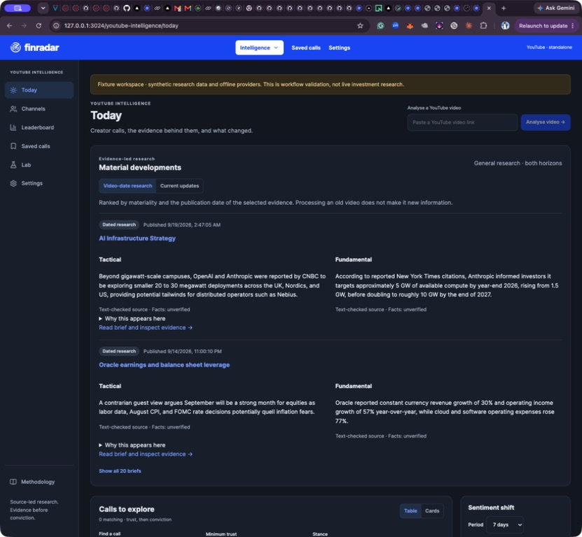
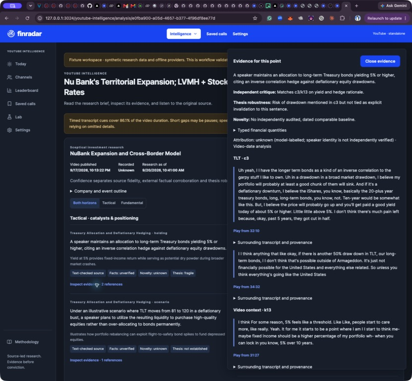

# Analysis performance: implementation and measurements

20 September 2026. Baseline: `140d6b2`; implementation: PR #10 (`codex/analysis-performance`). All four requested changes are implemented. No new LeapEdge analyses or paid provider requests were made for this build. Finradar integration remains excluded.

## Before and after

| Measurement | Before | After | Change | Evidence type |
| --- | ---: | ---: | ---: | --- |
| Extraction, eight chunks covering a 64-minute transcript | 3.319 s | 1.737 s | 47.7% less time | Median of three controlled runs per arm; fixed 400 ms provider responses |
| Four independent external searches | 1.670 s | 0.851 s | 49.1% less time | Median of three controlled runs per arm; same fixed responses |
| Manual analysis submitted last in a 100-job burst | 7.955 s | 0.469 s | 94.1% less time | One controlled real-PostgreSQL queue run per arm |
| Entire 100-job burst | 9.532 s | 10.680 s | **12.0% more time** | Same queue fixture; reserved interactive capacity reduces background capacity |
| Completion committed to result visible in Chrome | 8.108 s | 1.801 s | 77.8% less time | One observed DOM update per arm; includes polling phase; not P95 |
| Retained workspace snapshot, identical corpus | 13,376,151 bytes | 5,089,197 bytes | 62.0% fewer bytes | Serialized response on isolated copy of retained research |

These figures measure distinct things and must not be added together into a claimed end-to-end improvement. Provider fixtures prove scheduling/transport overhead with equivalent results, not real model latency or analytical accuracy. The queue harness continuously refills slots in both arms; it does not use the old fixed-wave comparison harness. Its executor is the real `processNext` runner with deterministic stage delays, not the production daemon's polling loop. The browser measurement uses retained data plus clearly labelled synthetic completion probes, with no provider request.

The queue fixture has 99 background videos and one manual video, global capacity eight, four stages per video, 100 ms per stage except every tenth video's 800 ms stages. All 100 complete; peak concurrency stays eight. The after arm caps background work at seven, intentionally leaving capacity for interactive requests. This is a responsiveness gain, not a throughput gain. Set `YTI_BACKGROUND_CONCURRENCY` to the global capacity only if maximising background throughput is preferred over a reserved slot.

## What changed

1. Durable stage timing records distinguish queue delay, stage execution and checkpoint work, retained with the run and backup. Processing details exposes the records; model attempt metrics additionally include provider-capacity waiting. A crash leaves an unfinished timing row rather than inventing a completion. Execution includes the timing insert; checkpoint measures through its final bookkeeping update, excluding transaction commit and post-stage experiment work. These are explicit boundaries, not a complete distributed trace of every HTTP/database subcall.
2. Manual requests and finishing research briefs precede ordinary/background work. Eligible work waiting over 120 seconds receives age priority; background admission has a separate shared cap. Global claims remain serialized through a short advisory-lock transaction and fenced leases. Single-slot configurations cannot reserve a separate interactive slot.
3. Up to two extraction chunks or independent retrievals execute concurrently. Extraction requests are durably frozen by chunk hash before calling providers, so splitting a truncated earlier chunk cannot renumber and re-bill a successful sibling. Completed sibling requests replay after interruption. Output assembly stays in source order; claim/key-point audits and transcript coverage rules are unchanged. Shared PostgreSQL permits cap in-flight calls across worker replicas (`YTI_PROVIDER_CONCURRENCY`, default eight). This is **not** an account RPM/TPM limiter; replicas must share the same configured cap.
4. The UI polls a small activity endpoint every two seconds, pages run summaries (50 default; 100 maximum), and requests full details on drill-down. Repeated internal extraction request payloads are excluded from workspace snapshots. Selection lists retain run metadata without duplicate full output. Late responses cannot regress displayed run state. Loaded older rows refresh without losing pagination position. One Chrome observation recorded 19 activity requests and only one full snapshot. The idle activity response was 176 bytes; the 50-row response was about 134 KB. Full snapshots still refresh on initial load, navigation/actions, new runs and terminal changes.

## Verification and visual evidence

- Automated suites, typecheck, production build and offline diagnostic gate: final results recorded in the delivery ledger. The legacy accuracy gate remains advisory-only; no human-verified accuracy claim is made.
- Real PostgreSQL: concurrent claims, SIGKILL/restart fencing, retained paid-response replay, shared provider cap (eight callers, peak two), and no leaked permits passed. The normal Postgres integrity check passed on the isolated after database.
- Parallel benchmark output hashes match across all six extraction/search fixture runs. Request counts remain eight extraction calls and four search calls per repetition, with no additional paid work in the fixtures.
- Desktop browser: approved dark/blue design retained; pagination expanded 50 to 54 analyses; long 65-minute report and its 86.1% coverage warning remained visible; evidence drawer retained source quotation, independent audit reasons, typed financial values and transcript/video timestamp links.
- Mobile visual check is **pending**. Chrome stopped returning screenshots/accessibility controls when the Mac became unavailable. The user explicitly asked to continue other work and revisit after unlocking. Do not treat the production build or desktop screenshot as mobile verification.

## Reproduce and inspect

- `scripts/performance-parallel-benchmark.mjs <checkout> <output.json>` runs actual extraction/retrieval steps through controlled fake providers in PGlite, blocks unexpected network traffic and emits requests, output hashes and timings. Use Node 24 with `--experimental-strip-types`. Run once against baseline `140d6b2` and once against this implementation.
- `scripts/performance-queue-benchmark.mjs before|after output.json` runs the deterministic 100-video fixture. Supply `YTI_DB=postgres`, `YTI_ISOLATED_DB=true`, `YTI_QUEUE_PAUSED=false`, and protected database URLs pointing to a **new, migrated localhost database whose name starts `yti_perf_`**. Use a distinct empty database for each arm and the same script in both checkouts. It inserts fixtures; never point it at application data. Database setup/cleanup is deliberately separate.
- Raw timings: [queue before](assets/performance-20260920/real-before.json), [queue after](assets/performance-20260920/real-after.json), [parallel before](assets/performance-20260920/parallel-before.json), [parallel after](assets/performance-20260920/parallel-after.json), [parallel comparison](assets/performance-20260920/parallel-comparison.json).
- Browser measurements: [before](assets/performance-20260920/before-display-latency.txt), [after](assets/performance-20260920/after-display-latency.txt). These are actual console/DOM observations, not repeated latency distributions.

## Release and remaining scale work

Migration **0007** must be applied through the direct database endpoint before deploying matching code. Stage timings are backed up; ephemeral provider permits are not. Preserve secrets and the application database during Mac runtime updates. The automatic worker queue remains paused; these tests do not authorise uncontrolled intake.

This build does **not certify 1,000 videos/day or a 100-video live burst**. Remaining work includes a bounded live workload with P50/P95 stage and end-to-end timings, account-specific request/token rate limits, durable hosted uptime if required, and burst/soak testing against actual provider quotas. Initial/terminal workspace refreshes still contain retained brief history (about 5 MB here), and the activity terminal count still grows with history; independently paginating briefs and maintaining a cheap revision counter remain future improvements. Native provider batch execution remains asynchronous and is not made interactive by this change.

Historical comparison context: the prior v8 cohort averaged 75.77 seconds of model work and 1,239.30 seconds elapsed under a different retained-transcript/wave harness. It is not a controlled before arm and is not used to calculate gains above. No new LeapEdge result or relative speed claim is inferred.

### Recorded release

PR #10 merged as `2210320884456760bd99e54c7a83c750f463ccad` on 20 September 2026.
Both GitHub CI runs passed. Each local full suite recorded 449 passed, zero
failed and one existing skip; the production dependency audit found zero
vulnerabilities. The Mac runtime has the identical implementation (`7b609a2`),
schema seven, HTTP 200 for the web/status/activity/run-page endpoints, and a
healthy paused worker. A database/code backup was taken before installation;
run count and secrets were preserved. Vercel production deployment
`youtube-intel-riio8gh5x-joshu-ai.vercel.app` is Ready and its build log confirms
migration 0007 applied. Hosted worker/provider activation remains separate.
The mobile visual check remains explicitly deferred until the Mac is unlocked.
