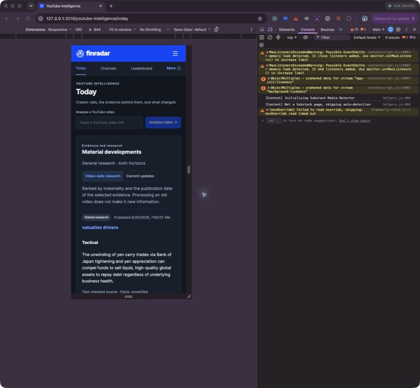
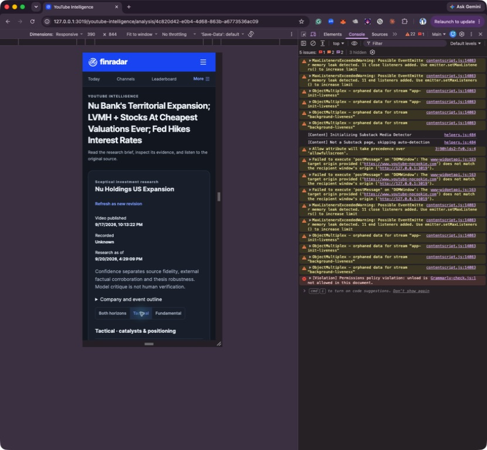
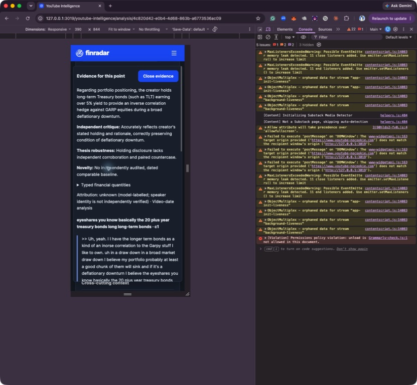
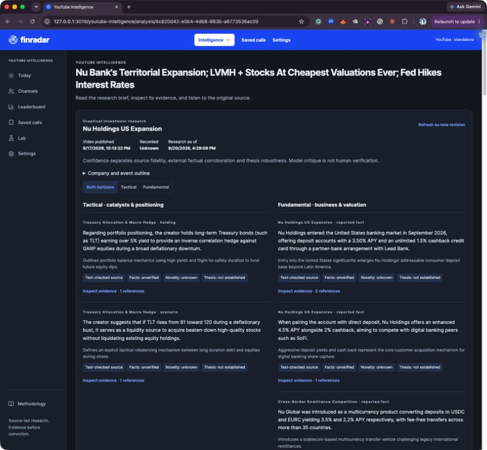
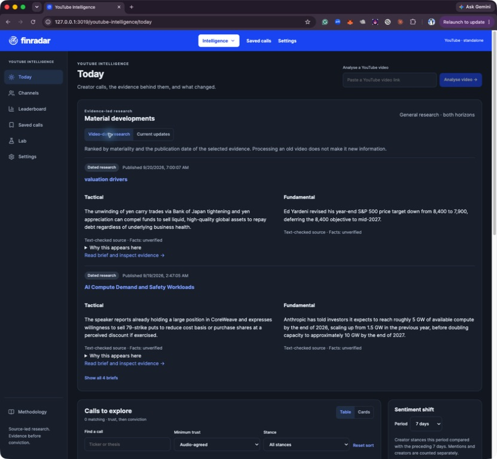

# Four-video production recovery and result review

All four analyses and all four research briefs completed after the user replenished Gemini prepayment credit. Execution used installed production code `7b609a2` (PR #10), the Mac `yti_live` database, live providers and three concurrent stage slots. Automatic scheduler/channel intake stayed paused. Recovery runs link to the four failed runs; three retained caption sets were reused and the Mandarin case resumed at windowed ASR. The earlier failed results were preserved. No new LeapEdge analysis was requested.

## Measured results

| Original case | Analysis ready (s) | Final brief ready (s) | Model USD | Search USD | Total USD | Accepted calls / context points |
| --- | ---: | ---: | ---: | ---: | ---: | ---: |
| 1 · SPIRV9UjNYU | 81.63 | 145.25 | 0.283763 | 0.028 | 0.311763 | 1 / 7 |
| 5 · M1FJ5dNiBEs | 40.46 | 138.18 | 0.153064 | 0.028 | 0.181064 | 2 / 5 |
| 11 · ZfOQoh82JTo | 122.62 | 179.67 | 0.615254 | 0.028 | 0.643254 | 2 / 21 |
| 18 · 1WNowIoNgtg | 91.55 | 185.21 | 0.383801 | 0.028 | 0.411801 | 5 / 12 |

Total recorded usage: **$1.54788125**, comprising $1.43588125 model usage and $0.112 Exa search. All 61 ledger entries are completed with no outstanding reservations/unknown outcomes. No additional caption credits were consumed during recovery; the earlier attempt consumed three. Gemini costs are token/rate calculations, OpenRouter costs use returned usage cost, and Exa costs use retrieval accounting; this is not an invoice or an account-wide billing reconciliation.

Durations begin at recovery submission and include queue waiting through the named completion. They exclude the credit-replenishment pause and previously completed caption ingestion. They are not fresh URL-to-render measurements. Browser rendering was inspected after completion; no new completion-to-paint latency distribution was measured.

## Stage execution time in seconds

| Stage | Mandarin #1 | AI compute #5 | Long podcast #11 | Options #18 |
| --- | ---: | ---: | ---: | ---: |
| Windowed transcription | 33.35 | 0.00 | 0.00 | 0.00 |
| Extraction | 6.56 | 7.41 | 22.20 | 15.73 |
| Translation | 9.65 | 0.00 | 24.86 | 13.87 |
| Independent analysis audit / recall | 19.40 | 14.99 | 52.09 | 34.44 |
| Analysis publication | 5.91 | 0.31 | 5.45 | 12.97 |
| Research planning | 4.58 | 3.23 | 3.61 | 4.45 |
| External retrieval | 9.28 | 10.92 | 9.98 | 9.11 |
| Research synthesis | 11.09 | 11.13 | 15.92 | 12.37 |
| Research audit / publication | 22.31 | 18.92 | 20.35 | 34.24 |
| Queue waiting, both runs | 20.37 | 70.87 | 23.53 | 46.44 |
| Checkpoint accounting | 2.87 | 0.54 | 1.74 | 1.80 |

Stage values sum durable executor timings, including internal parallel work once at the stage boundary. Queue and checkpoint time are shown separately; admission, inter-stage gaps and other orchestration make these approximate decompositions rather than an exact sum to elapsed time. Model-call durations must not be added to these stage durations because they overlap.

## Historical comparison: not a controlled speedup estimate

| Case | Prior v8 analysis elapsed (s) | Current analysis elapsed (s) | Identical source hash? | Prior / current accepted calls |
| --- | ---: | ---: | --- | ---: |
| 1 | 366.91 | 81.63 | No | 1 / 1 |
| 5 | 292.15 | 40.46 | Yes | 3 / 2 |
| 11 | 924.64 | 122.62 | No | 5 / 2 |
| 18 | 794.84 | 91.55 | Yes | 6 / 5 |

The old v8 cohort admitted twenty videos through a wave-based harness and reused sources; this run admitted four through a rolling harness, performed Mandarin ASR, and enabled live external retrieval. Provider load and nondeterministic outputs also differ. These elapsed differences therefore cannot be attributed solely to PR #10 or claimed as a fair percentage speedup. The earlier controlled fixture report remains the isolated before/after evidence.

## Result comparison and material findings

1. **Mandarin AI-market:** the retained LeapEdge report has one macro AI long idea. The new run also retains one conditional long-term AI thesis, with seven accepted context points and ten brief sentences. It preserves the condition that orders/earnings must remain intact. The new ASR source differs from the prior v8 source, so this is thematic comparison rather than exact-source parity.
2. **AI compute:** the retained LeapEdge output has Credo, Meta and Nvidia ideas; prior v8 also had three accepted calls. The new run has CoreWeave conditional put selling and Meta long, while Nvidia appears as context. CoreWeave is supported by the caption spelling “Cororeweave” and the explicit 79-strike discussion around 7:57; it is not an unsupported substitution. However, the clear Credo preference under the 170s at approximately 7:43–7:52 is absent from both accepted calls and the brief despite an identical transcript hash. **This is a concrete recall gap.** Do not equate fewer calls with greater precision or automatically copy LeapEdge labels.
3. **Long podcast:** the retained LeapEdge report stopped because it was too long. Our current analysis and brief both complete, covering Nu Holdings/remittances, valuation discussions and Treasury hedging. Current input is newly available captions with 99.87% timestamp coverage, not the earlier ASR transcript (86.1%). That availability change is not a performance-code gain. Only two TLT calls survive versus five prior v8 calls. Dutch Bros moat concerns remain in searchable transcript and accepted detailed context, but are omitted from the main brief; the independent coverage audit explicitly reports the omission. The brief needs a stronger company/topic coverage pass before it can be considered dependable for exhaustive research.
4. **Options:** retained LeapEdge has one PLTR put-selling idea; the new run retains five calls including Google/Microsoft position management. The brief preserves November 20 expiry and distinguishes put selling from buying shares outright. It also carries management of early-assigned Google shares and assignment/theta risks. There are repeated Google management calls and incomplete contract details in the top-level brief; consolidating related position actions while retaining strike/expiry/premium/size remains worthwhile.

**External verification remains limited:** 16 searches cost $0.112 and returned 48 retained evidence records, but all 44 accepted brief sentences remain `unverified` for factual corroboration and `video_date` in time mode. No eligible separately dated current-update sentence was accepted. Search success is not factual verification; dates, claims and primary-source support still need to satisfy the gates. The UI correctly exposes this limitation. Review retrieval selection/date evidence to improve usefulness rather than weakening the badge requirements.

## Browser verification

- Production Today showed the four new runs Ready and the earlier failures Recovered. The existing independent failure remained in Needs review.
- Desktop long-video report: approved Finradar dark/blue design; tactical/fundamental separation, confidence labels, independent audit and source controls remained present.
- Mobile at 390 × 844: navigation opens/closes; tactical filter removes fundamental content; evidence drawer fits the viewport and scrolls; Escape closes it and restores focus to its originating button. Measured document width and viewport were both 390px.
- Transcript search for Dutch returned six cues. Selecting the 1436.559-second cue updated the source link to 23:56 / `t=1436s`. This verifies navigation, not independent audio truth.
- Browser extension warnings and a YouTube origin/postMessage warning were visible; no full clean-console certification is claimed. Initial stale screenshots/window lookup errors resolved after the user foregrounded Chrome and the control session was reset.

## Next priorities

1. Add a targeted coverage reconciliation pass against the company/topic outline, with source-backed reasons for omission. Start with the identical-source Credo miss and long-podcast company coverage.
2. Consolidate overlapping same-company actions without losing strategy, position state, conditions or contract fields.
3. Improve primary-source retrieval and date confirmation; measure the share of accepted factual corroboration and useful separate current updates, not merely search counts.
4. Stop admitting untouched chunks after a fatal provider/account error while draining started siblings; the prior credit-blocked attempt exposed unnecessary rejected requests.

This test did not silently change prompts or rerun until outputs matched LeapEdge. Four successful cases establish recovery and observed performance, not 1,000-video/day capacity or independently verified accuracy.

Machine-readable results and stage timing: [production-resume-20260920.json](production-resume-20260920.json). Private full outputs remain under ignored `data/prod-resume-20260920` and in the local production database.

The production Current updates toggle was also exercised: it displayed an explicit
“No eligible, dated current updates” state rather than substituting video-date
research. The video-date view was restored. After the bounded run, queue pause
remained true, global concurrency returned to one, global ASR remained off, and
there were no open runs/jobs.

