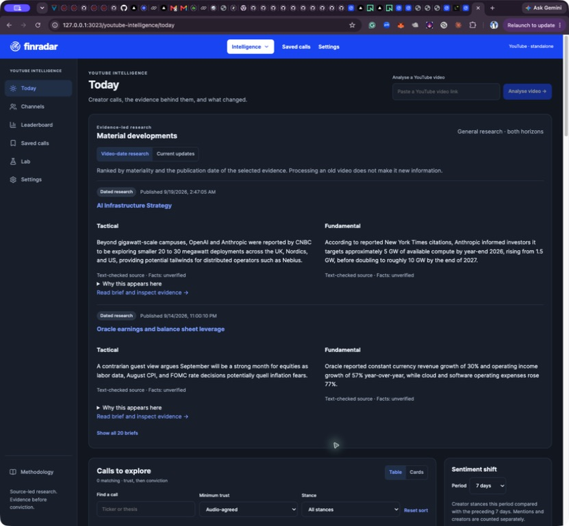
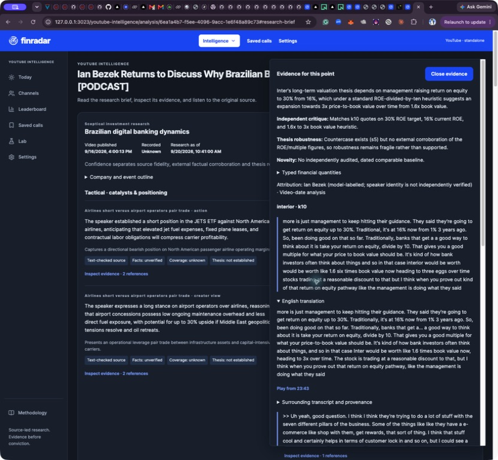
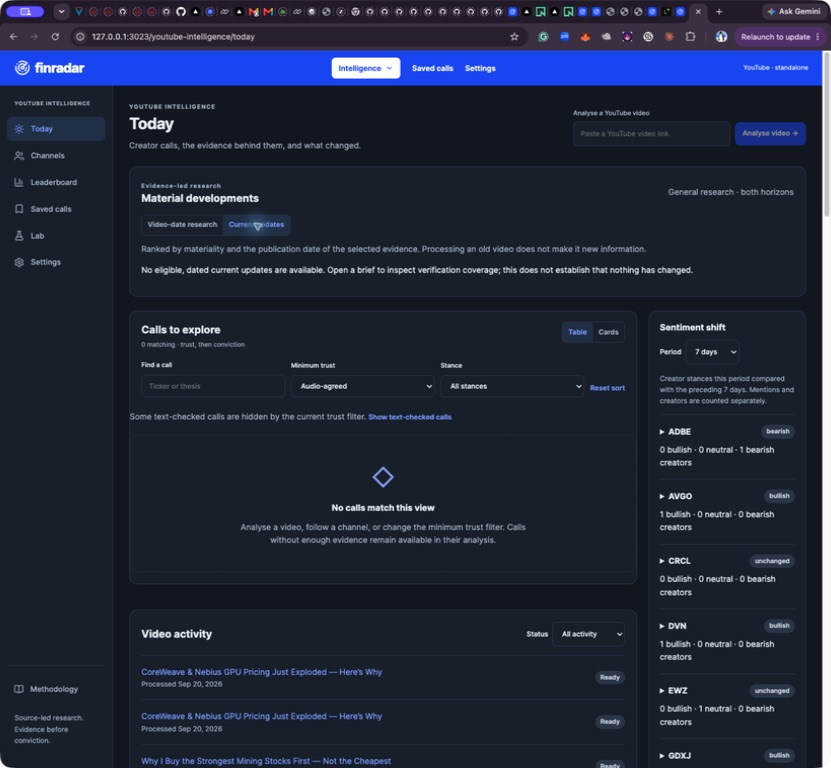
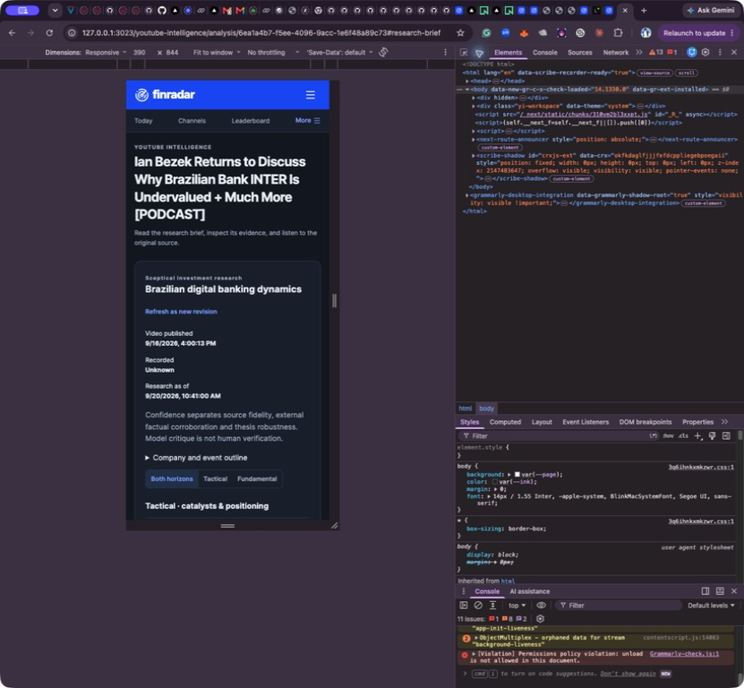
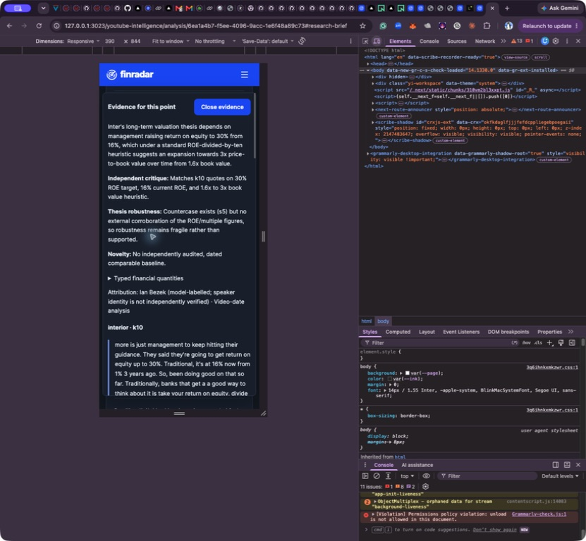

# Research implementation and retained-case verification

20 September 2026. PR #9, `codex/evidence-led-research`. Standalone scope; Finradar integration remains excluded.

## Delivered

The approved Finradar visual theme and existing call tools remain. Today now leads with material research, equal tactical/fundamental lanes, publication-date ranking, backfill/novelty explanations, and a separate current-update view. Analysis places the whole-video brief above the original calls, with horizon controls, saved revisions, company/event outline, confidence dimensions, exact evidence side panel, transcript search and timestamp playback. Save, Inspect, review, original context and processing diagnostics remain available.

Version v8 adds publication/recording context, 40-cue citable section overlap, and bounded recall of uncovered explicit stance passages. Recall preserves both calls and context and requires the independent critic before publication. New workspaces default to v8; stored workspace preferences and old prompt hashes are preserved. Existing workspaces can select v8 deliberately. A completed v8 analysis queues an independently audited research brief; old analyses can generate one from their retained accepted evidence.

The brief has sentence-level lineage, separate source/factual/thesis confidence, typed financial quantities and deterministic arithmetic checks. Novelty needs a dated retained baseline and independent audit; unknown is not new. Changed stance requires the same known speaker and channel. Historical evidence cannot cross the video-date cutoff. Current updates cannot appear without eligible dated external references. Model-labelled speaker identity remains explicitly qualified.

External retrieval is implemented with bounded queries, retained excerpts/hashes/date eligibility, cost reservations, provider-reported charges, and crash/timeout protection against automatic rebilling. Immutable research request traces include prompt, schema, payload, model/configuration and fingerprints. Retained original runs, source hashes, rejected drafts and charges remain available.

## Live results and cost

All **66 bounded jobs completed**: 20 briefs on the retained baseline, 20 v8 extractions with 20 briefs, and three targeted extraction/context rechecks with three briefs. There were **232 billed model calls**, with no unknown call charges. No source transcription or LeapEdge request was purchased in this build.

| Work | Recorded USD |
|---|---:|
| Baseline research briefs | 1.05824500 |
| 20 v8 extractions | 2.80885425 |
| V8 and targeted research briefs | 1.73251325 |
| Targeted extraction/context rechecks | 0.25319450 |
| **Incremental total** | **5.85280700** |

The preceding comparison/recovery cost was $4.93037670; combined recorded API usage across those runs and this build is **$10.78318370**. Native Gemini usage uses reported token counts and the configured dated price table; OpenRouter uses reported charges. These are retained usage-ledger totals, not a reconciled provider invoice. LeapEdge historical displayed costs are a separate reference and are not added to our API bill.

The selected final 20 briefs contain **223 accepted sentences, seven withheld sentences, 186 typed financial facts and one populated deterministic calculation**. Every accepted sentence resolves to retained evidence; every populated typed-fact quote resolves to its original retained quote. All 20 source hashes match their replay inputs. All live factual statuses remain **unverified** because no external search credential was available. More sentence counts are not an accuracy score.

## Comparison with saved LeapEdge outputs

The reference is 19 usable saved outputs; the long podcast's LeapEdge analysis had stopped. No new LeapEdge analyses were run. The following is a diagnostic content review, not a blinded benchmark, human gold set, forecast test, or claim of superiority.

| Case | Calls / context | Brief sentences | Saved LeapEdge calls | Result |
|---|---:|---:|---:|---|
| 1 | 1 / 5 | 10 | 1 | Preserves valuation compression versus earnings deterioration; creator/strategist attribution remains distinct. |
| 2 | 0 / 8 | 17 | 0 | Prominent non-trade brief explains contract financing and delivery dependencies. Contract value is not realised revenue. |
| 3 | 0 / 7 | 8 | 3 | Company/macro context stays visible without manufacturing DELL/SOX/SPY orders from commentary. |
| 4 | 9 / 7 | 13 | 4 | Preserves dated conditional technical setups, portfolio instructions and support/stop roles; publication date drives freshness. |
| 5 | 3 / 8 | 15 | 3 | Includes infrastructure demand, valuation and vendor economics. These remain video claims pending primary sources. |
| 6 | 0 / 7 | 8 | 2 | Recall recovered the explicitly bullish CoreWeave passage as independently accepted context, not an invented purchase. Nebius price changes and financing/dilution remain separate. |
| 7 | 8 / 6 | 12 | 4 | Preserves distinct holdings and conditional positions; brief groups economic themes. Similar holdings are not independent corroboration. |
| 8 | 3 / 16 | 14 | 2 | Oracle growth, expense and interest burden lead the fundamental brief; Adobe countercase and AI disruption remain distinct. |
| 9 | 1 / 7 | 14 | 1 | ADR premium and valuation assumptions remain unverified; no claim that a reported ticker, IPO or listing history was independently established. |
| 10 | 2 / 7 | 10 | 2 | Coherent and Lumentum fundamentals/risks retained. Raw caption ticker stays separate from the existing curated LITE identity. |
| 11 | 5 / 24 | 11 | unavailable | 65-minute source completes with 1,028 cues. No usable LeapEdge result exists; no agreement score assigned. |
| 12 | 10 / 19 | 13 | 1 | Inter valuation and countercase now lead the fundamental lane above existing call cards. Three unsupported/overstated brief points withheld. |
| 13 | 0 / 2 | 8 | 1 | Palantir 100x remains a scenario, not a buy. The brief shows the $35 trillion implication and distinguishes the smaller return exercise. |
| 14 | 0 / 4 | 9 | 1 | Mistral pending transaction and IDIQ ceiling remain conditional. Promotional business commentary is context rather than a fresh trade. |
| 15 | 0 / 1 | 3 | 0 | Three-point educational brief; no creator trade manufactured. |
| 16 | 11 / 7 | 13 | 6 | Captures sector memberships and ServiceNow view; raw NOW identity improves on earlier caption N. Does not turn a sector into an ETF. |
| 17 | 2 / 2 | 9 | 1 | Vistra purchase and Bloom holding remain distinct. Brief flags delayed 13F information and absence of real-time portfolio knowledge. |
| 18 | 6 / 11 | 14 | 1 | Preserves puts, assignments and covered calls as separate mechanics/conditions. Six extracted positions/strategies are not six new stock purchases; one brief point withheld. |
| 19 | 10 / 4 | 14 | 4 | 40-cue citable section overlap restores SSR Mining under the buy-now heading. Independent critic accepts it. Banyan/Cabral waiting conditions and 250-day source wording remain. |
| 20 | 2 / 4 | 8 | 1 | Existing silver position versus avoiding aggressive new entries coexist. Two brief statements withheld; captured LeapEdge numeric inconsistency is not copied. |

### Targeted corrections

- **SSR Mining:** the section introduction and item are now citable in the same chunk. The recovered long stance passed independent critique. Old outputs remain retained.
- **CoreWeave:** the recall model returned a bullish thesis as a context point. An implementation defect initially ignored recall context. A failing regression test caught this; the code now retains both categories. The already-paid response was recovered into a new run and independently accepted. It was not rebought or relabelled as a purchase.
- **Long transcript:** 3,920 seconds, 1,028 retained cues, 86.1269% union-of-cue timed coverage and no uncovered interval greater than three seconds. Short inter-cue gaps can be silence or missed words; this does not independently prove speech completeness. The UI shows the uncertainty. Original caption/ASR provenance remains available. No transcript prefix was silently used as the full video.

## Browser acceptance

Native Chrome control against a production build backed by the isolated comparison database:

- Desktop Today renders material briefs before activity/sentiment, preserves the Finradar blue header/dark surfaces, and retains original call filters and text-checked reveal.
- Research time controls were initially displaced by a shared absolute-position rule; visual inspection caught it and the final scoped CSS fix was rechecked.
- Current updates shows an explicit unavailable state, without implying nothing changed.
- Inter fundamental valuation and countercase appear above the original creator-call cards. Evidence opens with exact original text, separate translation, critic reason, confidence, typed quantities and provenance.
- Timestamp handoff loads the player and YouTube link at 23:43 (1,423 seconds). This checks navigation, not human audio verification.
- Transcript search returns original cue IDs and matching text. Existing calls/Save/Inspect remain visible.
- At 390×844, content stacks, horizon filtering works, and the evidence panel stays within the viewport. Escape closes it and restores focus to the invoking evidence button.

These checks are not WCAG certification or a screen-reader audit. Native browser extensions emitted their own warnings; this is not represented as an error-free browser console certification.

## Build checks

Both complete suites passed: **436 pass, one existing skip, zero failures** in each normal and PGlite run. TypeScript and the production build passed. The offline promotion command passed as an advisory-only historical diagnostic; the removed fifty-human-case requirement was not restored. No runtime dependencies were added. Real PostgreSQL backed all 66 live jobs and their resumptions.

## Remaining limits and activation

**Live external verification is blocked on EXA_API_KEY.** The adapter and date/cost/failure paths pass fixture tests; live primary-source corroboration and later developments have not been established. The pending credential request remains necessary. Add the key locally to the worker's environment, restart the worker, and create new brief revisions; existing historical briefs are immutable. Do not paste the key into chat. Search dates are conservative: an estimated provider date alone is excluded, and a matched publication label uses the end of that day.

The current primary-domain registry and curated listing resolver have limited coverage. Ambiguous symbols/share classes and speaker identities remain qualified; this build does not supply a comprehensive point-in-time security master, independent diarisation or universal issuer verification. Baseline novelty requires previous dated coverage; the initial cohort largely remains unknown. Summary synthesis can still omit a supported topic, and critic agreement is not a substitute for independent facts. More arithmetic kinds are tested than the live models elected to populate.

The separate hosted database still needs deliberate worker/provider configuration before it is an operational ingestion service. The Mac worker remains paused outside this bounded verification cohort. Do not copy databases or unpause paid channel processing implicitly. Hosted worker instructions remain in the standalone operations documentation.

[Machine-readable case results, costs and provenance](research-implementation-20260920.json).
